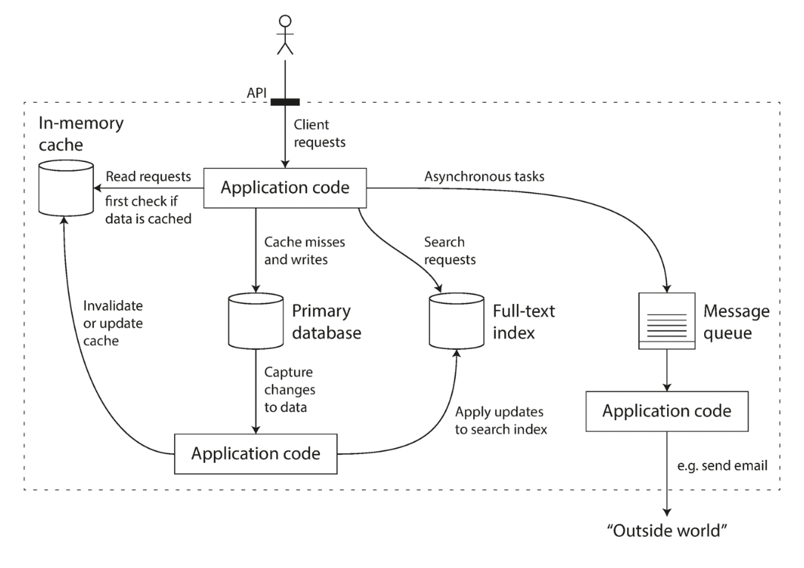

# Chapter 1. Reliable, Scalable, and Maintainable Applications

1. [Thinking About Data Systems](#Thinking-About-Data-Systems)
2. [Reliability](#Reliability)
    - [Hardware Faults](#Hardware-Faults)
    - [Software Errors](#Software-Errors)
    - [Human Errors](#Human-Errors)
3. [Scalability](#Scalability)
    - [Describing Load](#Describing-Load)
    - [Describing Performance](#Describing-Performance)
    - [Approaches for Coping with Load](#Approaches-for-Coping-with-Load)
4. [Maintainability](#Maintainability)
    - [Operability](#Operability:-Making-Life-Easy-for-Operations)
    - [Simplicity](#Simplicity:-Managing-Complexity)
    - [Evolvability](#Evolvability:-Making-Change-Easy)

Many applications today are **_data-intensive_** (oppsite: _computer-intensive_)
So, the problems are usually amount of data, the complexity of data, and the speed at which it is changing.

### Basic requirement of data-intensive applications

- `databases`: store and find data
- `caches`: speed up reads
- `search indexes`: search data by keyword of filter
- `stream processing`: send message to another process, handle asynchronously
- `batch processing`: periodically crunch a large amount of data

Let's learn about principles and practicalities of data systems and how you can use them to build data-intensive applications.

 

## Thinking About Data Systems

Tools for data systems(databases, queues, caches, etc) have some superficial similarity but different access patterns.  
The boundaries between the categories are becoming blurred - Redis: datastores that also used as MQ, Apache Kafka: database-like durability guarantees.  
And many applications today require different tools to stitch together using application code.  

ex. application-managed caching layer

When you design data system, you have to consider followings.   

- How do you ensure that the data remains correct and complete, event when things go wrong internally?
- How do you provide consistently good performance to clients, even when parts of your system are degraded?
- How do you scale to handle an increse in load?
- What does a good API for the service look like?

Let's consider three concerns that are important in most software systems to get answer.  

1. `Reliability` - work correctly
2. `Scalability` - dealing with system growths
3. `Maintainability` - maintaining, adapting new use case, work productively

 

## Reliability

`Reliability` means "working correctly".  
Followings are the example of reliable system.

- performing the function as user expected
- tolerating mistakes(from user or software)
- good enough performance
- preventing unauthorized access and abuse.  

`faults` means something that can go wrong.  
We call system that cope with this `faults`, `fault-tolerant` or `resilient`.

We can increase the rate of faults by triggering them deliberately and ensure fault-tolerance.  
The [Netflix Chaos Monkey](https://netflixtechblog.com/the-netflix-simian-army-16e57fbab116) is an example of this approach. 
 
### Hardware Faults

These are hardware faults - Hard disk crash, RAM becomes faulty, the power grid has a blackout, someone unplugs the wrong network cable.  
These things occur all the time when you have a lot of machines.  

For hardware faults, please add redundancy to the individual hardware components in order to reduce the failure rate of the system.  
For example, set disks in a [RAID](https://ko.wikipedia.org/wiki/RAID) configuration, dual power supplies, swappable CPUs.

However, as data volumes and applications' computing demands have increased, we have begun to use larger numbers of machines.
Therefore, there is move toward using software fault-tolerance techniques in preference or in addition to hardware redundancy.

### Software Errors

Software faults are correlated across nodes, they tend to cause many more system failures than uncorrelated hardware faults.  
Followings are the example of software faults.

- Software bug
- A runaway process that uses up some shared resources
- Slow down system, unresponsive
- Cascading failures 

There is no quick solution for software faults.  
Lots of small thins can help:

- careful thinks about assumptions and interactions in system
- thorough testing
- process isolation
- allowing processes to crash and restart
- measuring, monitoring, and analyzing system behavior

### Human Errors

Even when they have the best intentions, humans are known to be unreliable.  
The best systems combine several approaches:

- Minimize opportunities for error - well-designed abstractions(APIs)
- Provide non-production sandbox environments to explore and experiment safely
- Allow quick and easy recovery - configuration changes, codes, etc
- Set up detailed and clear monitoring - telemetry
- Implement good management practices and training

 

## Scalability

`Scalability` is the term we use to describe a system's ability to cope with increased load.

### Describing Load

Load can be descibed with a few numbers which we call _load parameters_ and it depends on the architecture of your system.  
ex. requests per second to a web server, the ratio of reads to writes in a database, the number of simultaneously active users in a chat room, the hit rate on a cache  

**Twitter Example**

### Describing Performance

Followings are factors that describe the performance of a system.

- `throughput`: the number of records we can process per second
- `response time`: time between a client sending a request and receiving a response

In a system handling a variety of requests, the response time can vary a lot.  
Therefore, we need to think of response time as a _distribution_ of values that you can measure.  

There are some _outliers_ that take much longer which is expensive because they process more data.  
Because of random additional latency by a context switch to a background process, the loss of a network packet and TCP retransmission, 
a garbage collection pause, a page fault forcing a read from disk, mechanical vibrations in the server rack.  

To know your "typical" response time, usually it is better to use _percentiles_.  
Take your list of response times and sort it from fastest to slowest, then the _median_ is the halfway point.  
To figure out how bad your outliers are, you can look at higher percentiles: the 95th or 99th or 99.9th which is knows as _tail latencies_.  

Percentiles are often used in _service level objectives(SLOs)_ and _service level agreements (SLAs)_, 
contracts that define the expected performance and availability of a service.  
ex. median response time of less than 200ms and a 99th percentile under 1s.

Queueing delays often account for a large part of the response time at high percentiles.  
When generating load artificially in order to test the scalability of a system, 
load-generating client needs to keep sending requests independently of the response time and that behavior has the effect of keeping queues shorter in the test.

### Approaches for Coping with Load

People often talk of a dichotomy between _scaling up (vertical scaling, moving to a more powerful machine)_ and _scaling out (horizontal scaling, distributing the load across multiple smaller machines)_.  
(Distributing load across multiple machines is also known as a _shared-nothing_ architecture.)  

There are _elastic_ systems which means they automatically add computing resources when they detect a load balance.
Using single machines is simpler, but we could not avoid _scaling out_ because of the costs.  
Taking stateful data systems from a single node to a distributed setup can introduce a lot of additional complexity.  
Therefore, the common wisdom until recently was to keep your database on a single node (scale up).  

However, as the tools and abstractions for distributed systems get better, it is conceivable that distributed systems will become the default in the future.  
The architecture of systems that operate at large scale is usually highly specific to the application. 
So, the problem may be related to characteristics of the application - volume of reads, writes, data to store, complexity of data, response time requirements, access patterns and some mixture of all of these issues.

 

## Maintainability

It is well known that the majority of the cost of software is ongoing maintenance.  
To minimize pain during maintenance, we will pay attention to three design principles for software systems:  

- `Operability`: run system smoothly for operations teams
- `Simplicity`: understand the system easily for new engineers
- `Evolvability`: make it easy to make changes for engineers - _extensibility, modifiability, plasticity_

### Operability: Making Life Easy for Operations

"good operations can often work around the limitations of bad software, but good software cannot run reliably with bad operations"  
A good operations team typically is responsible for the following. (I just copied)

- Monitoring the health of the system and quickly restoring service if it goes into a bad state
- Tracking down the cause of problems, such as system failures or degraded performance
- Keeping software and platforms up to date, including security patches
- Keeping tabs on how different systems affect each other, so that a problematic change can be avoided before it causes damage
- Anticipating future problems and solving them before they occur (e.g., capacity planning)
- Establishing good practices and tools for deployment, configuration management, and more
- Performing complex maintenance tasks, such as moving an application from one platform to another
- Maintaining the security of the system as configuration changes are made
- Defining processes that make operations predictable and help keep the production environment stable
- Preserving the organization’s knowledge about the system, even as individual people come and go

Data systems can do various thing to make routine tasks easy, including(I just copied): 

- Providing visibility into the runtime behavior and internals of the system, with good monitoring
- Providing good support for automation and integration with standard tools
- Avoiding dependency on individual machines (allowing machines to be taken down for maintenance while the system as a whole continues running uninterrupted)
- Providing good documentation and an easy-to-understand operational model (“If I do X, Y will happen”)
- Providing good default behavior, but also giving administrators the freedom to override defaults when needed
- Self-healing where appropriate, but also giving administrators manual control over the system state when needed
- Exhibiting predictable behavior, minimizing surprises

### Simplicity: Managing Complexity

If the project's size gets bigger and bigger, it often becomes very complex and difficult to understand.  
Therefore, it is called _big ball of mud_. 
There are various possible symptoms of complexity: explosion fo the state space, tight coupling of modules, tangled dependencies, inconsistent naming and terminology, and many more.  

Reducing complexity greatly improves the maintainability of software, thus simplicity should be a key goal for the systems we build.  
The goal is not to reduce its functionality, just remove _accidental complexity_.  
One of the best tools to remove accidental complexity is _abstraction_ that can hide a great deal of implementation detail behind a clean, simple-to-understand facade.  

For example, we use high-level programming languages that hide machind code, CPU registers, and syscalls.  
SQL is an abstraction that hides complex on-disk and in-memory data structures.  
We do not use it _directly_, because the programming languate abstraction saves us from having to think about it.

### Evolvability: Making Change Easy

Systems are much more likely to be in constant flux: you learn new facts, unanticipated use cases, business priorities change, new feature requirements, replace platforms etc.  
In terms of organizational processes, _Agile_ working patterns provide a framework for adapting to change.  
We call agility from data system level: _evolvability_

The ease with which you can modify a data system, and adapt it to changing requirements, is closely linked to its simplicity and its abstractions: 
simple and easy-to-understand systems are usually easier to modify than complex ones.
