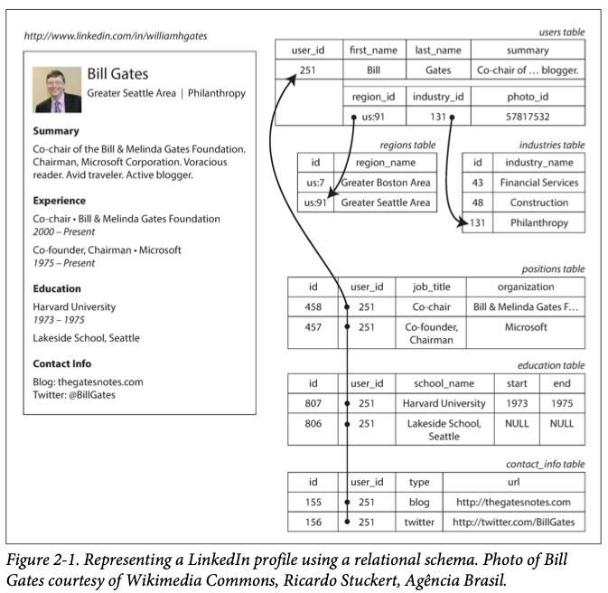

# Chapter 2. Data Models and Query Languages

1. [Relational Model Versus Document Model](#Relational-Model-Versus-Document-Model)
2. [The Birth of NoSQL](#The-Birth-of-NoSQL)
3. [The Object-Relational Mismatch](#The-Object-Relational-Mismatch)
4. [Many-to-One and Many-to-Many Relationships](#Many-to-One-and-Many-to-Many-Relationships)
5. [Are Document Databases Repeating History?](#Are-Document-Databases-Repeating-History?)
6. [Relational Versus Document Databases Today](#Relational-Versus-Document-Databases-Today)
7. [Query Languages for Data](#Query-Languages-for-Data)
8. [Declarative Queries on the Web](#Declarative-Queries-on-the-Web)
9. [MapReduce Querying](#MapReduce-Querying)
10. [Graph-Like Data Models](#Graph-Like-Data-Models)
11. [Property Graphs](#Property-Graphs)
12. [The Cypher Query Language](#The-Cypher-Query-Language)
13. [Graph Queries in SQL](#Graph-Queries-in-SQL)
14. [Triple Stores and SPARQL](#Triple-Stores-and-SPARQL)
15. [The Foundation: Datalog](#The-Foundation:-Datalog)

In a complex application, there are many layers and each layers hides the complexity of the layers below it by providing a clean data model.  
These abstractions allow difference groups of people to work together effectively.  

There are many difference kinds of data models, and every data model embodies assumptions about how it is going to be used.  
Since the data model has a profound effect on what the software above it can and can't do, it's important to choose one that is appropriate to the application.  

<br/>

## Relational Model Versus Document Model

- 1970s ~ early 1980s : _network model_, _hierarchical model_
- late 1980s and early 1990s : Object databases
- early 2000s : XML databases

The best-known data model today is probably that of _SQL_, based on the relation model: data is organized into _relations_.  
The root of relational databases lie in _business data processing_. (today, _transaction processing, batch processing_).  
Now, relational databases turned out to generalize very well, beyond their original scope of business data processing.  

<br/>

## The Birth of NoSQL

In the 2010s, _NoSQL_ is the latest attempt to overthrow the relation model's dominance.  
Followings a re driving forces behind the adoptation of NoSQL.  

- A need fot greater scalability
- A widespread preference for free and open source software over commercial database products
- Specialized query operations
- Frustration with the restrictiveness of relation schemas
- Desire for a more dynamic and expressive data model

<br/>

### Resume example for further explanation



## The Object Relational Mismatch

**_impedance mismatch_**: disconnect between the models  
If data is stored in relational tables, an awkward translation layer is required between the objects in the application code and the database model of tables, rows, and columns.  
Object-relation mapping(ORM) frameworks like `ActiveRecord` and `Hibernate` can be used, but they can not completely hide the differences between the two models.  

Therefore, in resume application  
The JSON representation has better _locality_ thant the multi-table schema.  
In the JSON representation, all the relevant information is in one place, and one query is sufficient.  

<br/>

## Many to One and Many to Many Relationships

There are some advantages to having standardized lists:  
consistent style and spelling, avoiding ambiguity, ease of updating, localization support, better search

Advantage of using an ID
- it has no meaning to humans, it never needs to change
- no duplication 
- no write overhead when data changes
- no risk consistencies when data changes

Removing such duplication is the key idea behind _normalization_ in databases.  
And normalizing this data requires _many-to-one_ relationships.  

Even if resume application fits well in a join-free document model(JSON), 
data has a tendency of becoming more interconnected as features are added to applications.  
Therefore, it leads to _many-to-many_ model.  

<br/>

## Are Document Databases Repeating History? 

1970s, the most popular database for business data processing was IBM's _Information Management System (IMS)_.  
It used _hierarchical model_, which is similar to the JSON model.  
However, it worked well with one-to-many relationships, but not with many-to-many relationships.  
So, various solutions proposed and most prominent were _relational model_ and _network model_.  

### The network model

The network model was standardized by the Conference on Data Systems Languages(CODASYL), and it is also known as  _CODASYL_ model.  

A record could have multiple parents.  
The link between records was called _access path_ which works like pointers in a programming language.  
A query in CODASYL was performed by moving a cursor through the databases by iterating over lists of records and following access paths.  

However, it was like navigating around an n-dimensional data space and querying and updating the databases were complicated and inflexible.  
It was difficult to make changes to an application's data model.  

### The relational model

In contrast, the relational model lay out all the data in the open: relation(table) is simply a collection of tuples(rows).  
There are no labyrinthine nested structures, no complicated access paths to follow.  

In a relational database, the query optimizer automatically decides which parts of the query to execute in which order, and which indexes to use.  
Thus relational model make it much easier to add new features to applications.  

<br/>

## Relational Versus Document Databases Today

There are some differences to consider relational databases vs document databases : `fault-tolerance properties`, `handling of concurrency`

|Model|Advantage|
|---|---|
|Document data model|schema flexibility, better performance due to locality|
|Relational model|supports for joins, many-to-one and mony-to-many relationships|

### Which data model leads to simpler application code?

The relational technique of _shredding(splitting a document-like structure into multiple tables)_ can lead to cumbersome schemas and complicated application code.  
However, there are some limitations of document model: 

- cannot refer directly to a nested item within a document
- poor support for joins  

You can reduce the need for joins by _denormalizing_, but the application code needs to do additional work to keep the denormalized data consistent.  
 
Generally, which data model leads to simpler application code:  
it depends on the kinds of relationships that exist between data items.  

### Schema flexibility int the document model

No schema means that arbitrary keys and values can be added to a document, 
and when reading, clients have no guarantees as to what fields the documents may contain.  
Document databases are not _schemaless_, there is an implicit schema, and it's not enforced by the database.  

- `schema-on-read`: structure of data is implicit, similar to dynamic(runtime) type checking
- `schema-on-write`: traditional approach of relational databases, similar to static (compile-time) type checking  

The difference between the approaches is noticeable when an application wants to change the format of its data.  
Schema changes have a bad reputation of being slow and requiring downtime.  
In case of MySQL `ALTER TABLE` query, it copies the entire table that costs minutes or even hours of downtime.  
Therefore, the `schema-on-read` approach is advantageous if the items in the collection don't all have the same structure for some reason.  

### Data locality for queries

A document is usually stored as a single continuous string(encoded as JSON, XML etc).   
If your application often needs to access the entire document, 
there is a performance advantage to this _storage locality_.  

The locality advantage only applies if you need large parts of the document at the same time.  
It is generally recommended to keep documents fairly small and avoid writes.  
These performance limitations significantly reduce the set of situations in which document databases are useful.  

The idea of grouping related data together for locality is not limited to document model.  

- Google's Spanner database - offers locality properties in relational data model
- Oracle - offers same functions using a feature called `multi-table index cluster tables`
- Cassandra and HBase - `column-family` concept

### Convergence of document and relational databases

Given the popularity of JSON for web APIs, other relational databases follow in their footsteps and add JSON support.  

- RethinkDB - supports relational-like joins in its query language
- MongoDB - automatically resolve database references

A hybrid of the relational and document models is a good route for databases to take in the future.  

<br/>

## Query Languages for Data

SQL is a `declarative` query language, whereas IMS & CODASYL uses `imperative` code.  

- imperative language tells the computer to perform certain operations in a certain order
- declarative query language - you must specify the pattern of the data you want, not _how_ to achieve that goal

A declarative query language

- typically more concise and easier to work with that an imperative API
- hides implementation details of the database engine
- database system can introduce performance improvements without changes in query
- does not guarantee any particular ordering
- limited functionality gives the database much more room for automatic optimizations
- can lend themselves to parallel execution

<br/>

## Declarative Queries on the Web

The advantages of declarative query are not limited to just databases.  

- CSS, XSL - _declarative_ languages for specifying the styling of a document
- JavaScript - imperative approach using the core Document Object Model(DOM) API

In a web browser, using declarative CSS styling is much better than manipulating styles imperatively in JavaScript.

<br/>

## MapReduce Querying

**_MapReduce?_**

- a programming model for processing large amounts of data in bulk across many machines.  
- supported by some NoSQL datastores(MongoDB and CouchDB).  
- neither a declarative query language nor a fully imperative query API.  

```MapReduce
db.observations.mapReduce( 
    function map() {
        var year = this.observationTimestamp.getFullYear();
        var month = this.observationTimestamp.getMonth() + 1; 
        emit(year + "-" + month, this.numAnimals);
    },
    function reduce(key, values) {
        return Array.sum(values); 
    },
    {
        query: { family: "Sharks" },
        out: "monthlySharkReport"
    }
);
```

They must be _pure_ functions : they only use the data passed to them as input, 
they cannot perform additional database queries, and must not have any side effects.  
However, they are nevertheless powerful.  

**_Pain Point?_**

- two carefully coordinated Javascript functions: harder than writing a single query
- declarative query language offers more opportunities for a query optimizer to improve the performance of a query  

MongoDB 2.2 support declarative query language called _aggregation pipeline_.  

<br/>

## Graph Like Data Models 

one-to-many relationships(tree-structured data) or no relationships between records -> use `document model`  
many-to-many relationships and complex connections within your data -> use `graph-like data model`!

**_Graph-Like Data Model?_**

- _vertices_ + _edges_
- not limited to _homogeneous_ data
- provide a consistent way of storing completely different types of objects in a single datastore

<br/>

## Property Graphs

each vertex consists of:

- a unique identifier
- a set of outgoing edges
- a set of incoming edges
- A collection os properties(key-value pairs)

each edge consists of:

- a unique identifier
- the tail vertex
- the head vertex
- a label to describe the king of relationship between the two vertices
- a collection of properties(key-value pairs)

**_Some important aspects?_**

- any vertex can have an edge
- _traverse_ the graph
- use different labels for different kinds of relationships  

Those feature give graphs a great deal of flexibility for data modeling.  
Graphs are good for evolvability: graph can easily be extended when you add features  

<br/>

## The Cypher Query Language

_Cypher_ is a declarative query language for property graphs, created for the Neo4j graph database.  

```SQL
MATCH
    (person) -[:BORN_IN]->  () -[:WITHIN*0..]-> (us:Location {name:'United States'}),
    (person) -[:LIVES_IN]-> () -[:WITHIN*0..]-> (eu:Location {name:'Europe'}) 
RETURN person.name
```

## Graph Queries in SQL

In relational database, you usually know in advance which joins you need in your query.  
In a graph query, you may need to traverse a variable number of edges before you find the vertex you're looking for.  

## Triple Stores and SPARQL

The triple-store model is mostly equivalent to the property graph model.  
All information is stored in form of very simple three-part statements(_subject, predicate, object_).  

Semantic Web -> RDF data model -> SPARQL

## The Foundation: Datalog

... 
