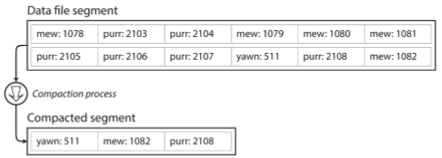
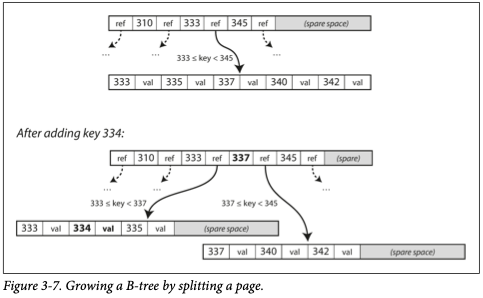
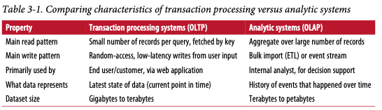

# Chapter 3. Storage and Retrieval

1. [Data Structures That Power Your Database](#Data-Structures-That-Power-Your-Database)
2. [Hash Indexes](#Hash-Indexes)
3. [SSTables and LSM-Trees](#SSTables-and-LSM-Trees)
4. [B-Trees](#B-Trees)
5. [Comparing B-Trees and LSM-Trees](#Comparing-B-Trees-and-LSM-Trees)
6. [Other Indexing Structures](#Other-Indexing-Structures)
7. [Transaction Processing or Analytics?](#Transaction-Processing-or-Analytics?)
8. [Data Warehousing](#Data-Warehousing)
9. [Stars and Snowflakes: Schemas for Analytics](#Stars-and-Snowflakes:-Schemas-for-Analytics)
10. [Column-Oriented Storage](#Column-Oriented-Storage)
11. [Column Compression]
12. [Set Order in Column Storage]
13. [Writing to Column-Oriented Storage]
14. [Aggregation: Data Cubes and Materialized Views]

 

To tune a storage engine to perform well on your workload, 
you need to have a rough idea of what the storage engine is doing under the hood.  

In particular, there is a big difference between storages engines  
1. which are optimized for transactional workloads
2. which are optimized for analytics.  

Let's examine two families of :star2: _log-structured_ storage engines, and :star2: _page-oriented_ storage engines such as B-trees.  

## Data Structures That Power Your Database

Many databases internally use a :star2: _log_ which is an append-only data file to deal with mores issues
(concurrency control, reclaiming disk space, handling errors, partially written records).  
In addition, in order to efficiently find the value for a particular key in the database, we need a difference data structure: :star2: _index_
Therefore, the general idea behind them is 1. to keep some additional metadata on the side and 2. if you want to search, you may need several difference indexes on different parts of the data.  

An index is an _additional structure_.  
Many data-bases allow you to add and remove indexes, and it should not affect the contents of the databases; it only affects performance.  
Any kind of indexes usually slows down writes, because the index need to be updated everytime when data is written.  

Therefore, :heavy_exclamation_mark: **well-chosen indexes speed up read queries, but every index slow down writes**.  
For this reason, databases don't usually index everything by default, you can choose the indexes that give your application the greatest benefit, 
without introducing more overhead than necessary.  

 

## Hash Indexes

Let's start with indexes for key-value data which is similar to the _dictionary_ type.  
The simplest possible indexing strategy is this: keep an in-memory hash map where every key is mapped to a byte offset in the data file.  
This may sound simplistic, but it is a viable approach.  

In this case, [Bitcask](https://en.wikipedia.org/wiki/Bitcask) offers high-performance reads and writes.  
The values can be loaded from disk to memory with just one disk seek.  
A storage engine like Bitcask is well suited to situations where the value for each key is updated frequently.  

But, how do we avoid eventually running out of disk space?
A good solution is to break the log into segments of a certain size by closing a segment file.  
We can perform _compaction_ on these segments like below image.  

Compaction makes segments much smaller.  
We can also merge several segments together at the same time, and it could be done in a background thread.  

Each segment now has its own in-memory hash table, mapping keys to file offsets.  
In order to find the key, we check from the latest.   
The merging process keeps the number of segments small, so lookups don't need to check many hash maps.  

**Issues that are important in a real implementation**  

- _File format_: binary format is faster than csv format
- _Deleting records_: append a special deletion record to the data file
- _Crash recovery_: in-memory hash maps are lost when restarted. use a snapshot of each segment's hash map on disk  
- _Partially written records_: include checksums allowing corrupted parts of the log to be detected and ignored
- _Concurrency control_: Data file segments are append-only and otherwise immutable

**Why append-only design is good**

- Appending and segment merging are sequential write operations - much faster than random writes  
- Concurrency and crash recovery are much simpler  

**Limitation of Hash Tables**

- must fit in memory
- range queries are not efficient

 

## SSTables and LSM Trees

Let's change out segment files: _sort by key_  
We call this format _Sorted String Table_, or _SSTable_.  
We also require that each key only appears once within each merged segment file.  

**Advantages of SSTables**

1. Merging segments is simple and efficient - similar to _mergesort_
2. No longer need to keep an index of all the keys in memory to find particular word - it can be sparse  
3. Can group records into a block and compress it before writing it to disk  

### Constructing and maintaining SSTables

With tree data structures like red-black trees and AVL trees, you can insert keys in any order and read them back in sorted order.  

- Write data to an in-memory balanced tree data structure. This in-memory tree is sometimes called a _memtable_. 
- When the memtable gets bigger than some threshold - write it out to disk as and SSTable file.  
- To serve read request, first try to find the key in the memtable, most recent to the oldest one.  
- From time to time, run a merging and compaction process in the background.  

One problem from this scheme: if the databases crashes, the most recent writes are lost.  
In order to avoid that problem, we can keep a separate log on disk to which every write is immediately appended.  

### Making an LSM tree out of SSTables

Following algorithm is used in LevelDB and RocksDB, key-value storage engine libraries that are designed to be embedded into other applications.  
Originally this indexing structure was described under the name _Log-Structured Merge-Tree_(or LSM-Tree), building on earlier work on log-structured filesystems.  
Storage engines that are based on this principle of merging and compacting often called LSM storage engines.  

Lucene, an indexing engine for full-text used by Elasticsearch and Solr, uses a similar method for storing its _term dictionary_.  
This is implemented with a key-value structure where the key is a word (_a term_) and the value is the list of IDs of all the documents that contain the word (_the postings list).  

### Performance optimizations

In order to optimize this kind of access, storage engines often use additional _Bloom filters_.  
It's a memory-efficient data structure for approximating the contents of a set, it can tell you if a key does not appear in the database.  

The most common options to determine the order and timing of how SSTables are compacted and merged are _size-tiered_ and _leveled_ compaction.
- LevelDB, RocksDB use leveled compaction
- HBase uses size-tiered
- Cassandra support both

In level compaction, the key range is split up into smaller SSTables and older data is moved into separate "levels", 
which allows the compaction to proceed more incrementally and use less disk space.  

The basic idea of LSM-trees(keeping a cascade of SSTables that are merged in the background) is simple and effective.  
It works well when the dataset is much bigger than the available memory.  
Since data is stored in sorted order, you can efficiently perform range queries.

 

## B Trees

_B-tree_ is the most widely used indexing structure.  
B-trees keep key-value pairs sorted by key, which allows efficient key-value lookups and range queries.  
However, the B-trees have  a very different design philosophy.  

B-trees break the database down into fixed-size _blocks_ or _pages_(log-structured indexes - variable-size _segments_).  
When you want to look up a key in the index, you start from the root.  
Each page contains several keys and references to child pages.  
_branching factor_ : the number of references to child pages in one page of the B-tree

This algorithm ensures that the tree remains _balanced_.  
Most databases can fit into a B-tree that is three or four levels deep.  

### Making B-trees reliable

All references to that page remain intact when the page is overwritten.  
This is contrast to log-structured indexes such as LSM-trees, which only append to files but never modify files in place.  

In order to make the database resilient to crashes
- use additional data structure on disk: _a write-ahead log_
- careful concurrency control if multiple threads are going to access the B-tree at the same time - protect tree structures with _latches_(lightweight locks)  

### B-tree optimizations

- Instead of overwriting and maintaining, just write modified page to a different location. It is useful for concurrency control  
- Do not store the entire key, but abbreviate it.  
- Pages can be positioned anywhere on disk - nothing requiring pages with nearby key ranges to be nearby on disk  
- Additional pointers have been added to the tree. ex. sibling pages
- B-tree variants such as _fractal trees_ borrow some log-structured ideas to reduce disk seeks

 

## Comparing B Trees and LSM Trees

**_write amplification_**: one write to the database resulting in multiple writes to the disk  
write amplification has a direct performance cost

### LSM-Trees

- faster for writes
- log-structured base

**Advantages**

- higher write throughput than B-trees 
- sometimes have lower write amplification
- sequentially write compact SSTable rather than having to overwrite several pages - particularly important on magnetic hard drives
- smaller files on disk than B-trees
- lower storage overheads especially when using leveled compaction

**Downsides**

- the compaction process can sometimes interfere with the performance of read and writes
- response time of queries can sometimes be quite high
- multiple copies of the same key in difference segments

### B-Trees

- faster for reads

**Advantages**

- response time for queries can be more predictable
- each key exists in exactly one place in the index

**Downsides**

- must write every data at least twice: write-ahead log, page itself
- having to write an entire page at a time even though small changes
- unused disk space for fragmentation

 

## Other Indexing Structures

- _primary key_ that refer to row/document/vertex
- _secondary indexes_ : crucial for performing join efficiently, not unique

### Storing values within the index

**heap files**

Use key in an index for reference to the row stored elsewhere.  
_Heap files_ mean the reference the row stored.  
This approach avoids duplicating data when multiple secondary indexes are present.  

Therefore, it is very efficient when updating a value without changing the key.  
However, the new value must be not larger than old value.  
Otherwise, this approach became complicated because it has to find a new location which has enough space.  

In addition, 
- _clustered index_ stores the indexed row directly within an index.  
- _covering index or index with included columns_ stores some of a table's columns within the index

Clustered and covering indexes can speed up reads, but they require additional storage and can add overhead on writes.  

### Multi-column indexes

_concatenated index_ is the most common type of multi-column index

ex. restaurants which latitude is more than 00, longitude lower than 00.  

More commonly, specialized special indexes such R-trees are used.  

### Full-text search and fuzzy indexes

_Fussy_ querying requires different techniques.  
Full-text search engines commonly allow a search for one word to be expanded to include synonyms of the word.
(Pass..)

### Keeping everything in memory

(Pass..)

 

## Transaction Processing or Analytics?

_transaction_ refers to a group of reads and writes that form a logical unit.  
A transaction necessarily have ACID (atomicity, consistency, isolation, and durability).

- _Transaction processing_: allow clients to make low-latency reads and writes
- _Batch processing_: only run periodically

In the early days of business data processing, the basic access pattern remained similar to processing business transactions.  
This access pattern known as _online transaction processing(OLTP)_.

Databases started being used for _data analytics_ known as _online analytic processing(OLAP).
- scan over a hugh number of records
- only reading a few columns per record
- calculates aggregate statistics

In the late 1980s and early 1990s, there was a trend for companies to stop using OLTP systems for analytics perposes,
run the analytics on a separate database instead - _data warehouse_.  

 

## Data Warehousing

Ad hoc analytic queries on an OLTP databases are ofter expensive, scanning large parts of dataset, 
which can harm the performance of concurrently executing transactions.

A _data warehouse_ is a separate database that analysts can query without affecting OLTP operations.  
The data warehouse contains a read-only copy of the data in all the various OLTP systems in the company.  

Data is extracted from OLTP databases and transformed into an analysis-friendly schema, cleaned up, and then loaded into the data warehouse - known as _Extracted-Transform-Load (ETL)_

A big advantage of using a separate data warehouse is that it can be optimized for analytic access patterns.  
It turns out that indexing algorithm(LSM-trees, B-trees) are not good at analytic queries.  

### The divergence between OLTP databases and data warehouses

On the surface, a data warehouse, and a relational OLTP database look similar.  
However, the internals of the systems can look quite different, because they are optimized for very different query patterns.  

Data warehouse example
Microsoft SQL Server, SAP HANA, Teredata, Vertica, ParAccel, Apache Hive, Spark SQL, Cloudera, Impala, Facebook Presto, Apache Tajo, and Apache Drill

 

## Stars and Snowflakes: Schemas for Analytics

In analytics, there is much less diversity of data models.  
Many data warehouse are used the style knows as a _style schema(dimensional modeling)_.    

- _Dimension tables_: some columns are attribute and others are foreign key references to other tables.
- _Star schema_: the table relationships are visualized, the fact table is in the middle, surrounded by its dimension tables
- _Snowflake schema_: dimensions are further broken down into subdimensions 

Snowflake schemas are more normalized than star schemas, 
but star schemas are often preferred because they are simpler for analysts to work with.  

 

## Column Oriented Storage

In most OLTP databases, storage is laid out in a _row-oriented_ fashion.  
When you want to process a query, row-oriented storage engine still needs to load all of those rows from disk into memory, parse data, etc.
With _column-oriented_ storage, don't store all the values from on row together.

 

## Column Compression

We can reduce the demands on disk throughput by compressing data.  
One technique tha is particularly effective in data warehouses is _bitmap encoding_.  

The number of distinct values in a column is small compared to the number of rows.  
If _n_ is very small, those bitmaps can be stored with one bit per row.

### Memory bandwidth and vectorized processing

Developers of analytical databases worry about efficiently using the bandwidth from main memory into the CPU cache, 
avoiding the branch mispredictions and bubbles in the CPU instruction processing pipeline, 
and making use of single-instruction-multi-data(SIMD) instructions in modern CPUs.  

Besides reducing the volume of data, column-oriented storage are also good for making efficient use of CPU cycles.  
- compressed column data that fits CPU's L1 cache and iterate in a tight loop

This techniques is known as _vector processing_.  

## Sort Order in Column Storage

## Writing to Column-Oriented Storage

## Aggregation: Data Cubes and Materialized Views
