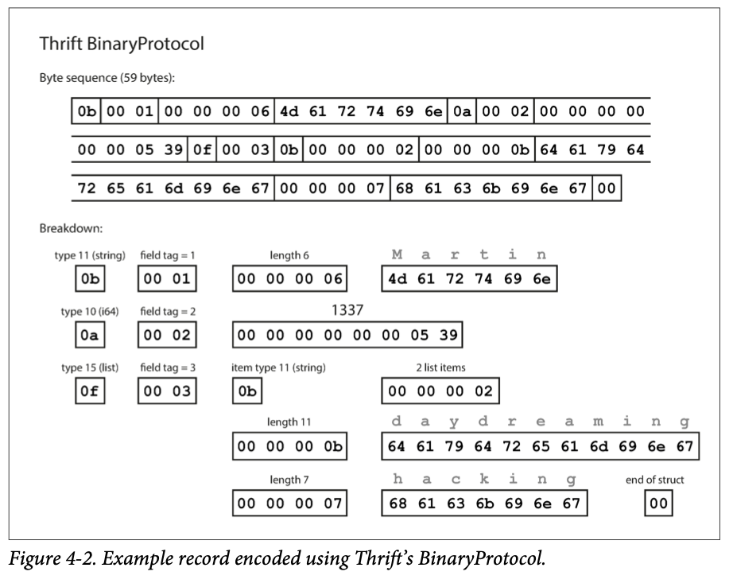
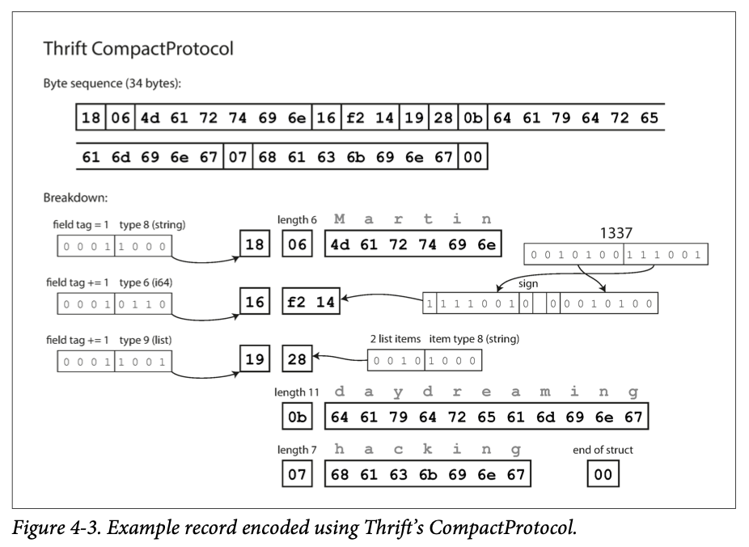
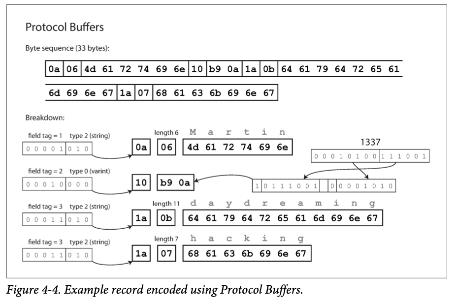
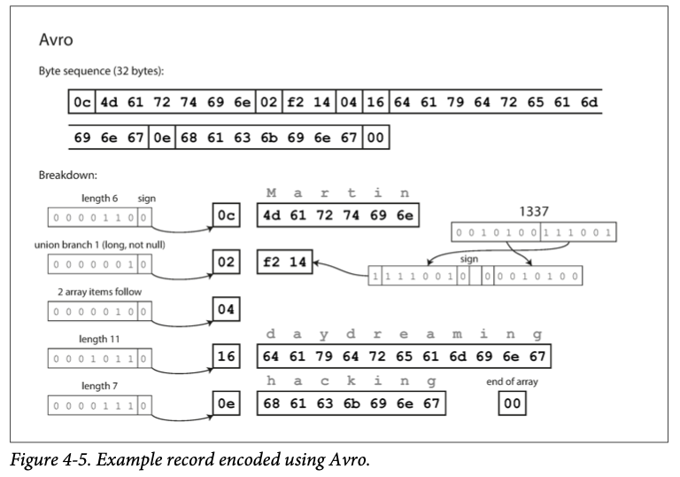

# Chapter 4. Encoding and Evolution

1. [Formats for Encoding Data](#Formats-for-Encoding-Data)
    - [Language Specific Formats](#Language-Specific-Formats)
    - [JSON, XML, and Binary Variants](#JSON,-XML,-and-Binary-Variants)
    - [Thrift and Protocol Buffers](#Thrift-and-Protocol-Buffers)
    - [Avro](#Avro)
    - [The Merits of Schemas](#The-Merits-of-Schemas)
2. [Modes of Dataflow](#Modes-of-Dataflow)
    - [Dataflow Through Databases](#Dataflow-Through-Databases)
    - [Dataflow Through Services: REST and RPC](#Dataflow-Through-Services:-REST-and-RPC)
    - [Message Passing Dataflow](#Message-Passing-Dataflow)

 

We should aim to build systems that make it easy to adapt to change(_evolvability_).  
In most cases, the system requires data to change:  

- Relational databases: schema can be changed(i.e ALTER statement)
- schema-on-read: mixture of older and newer data

When a data format or schema changes, a corresponding change to application code often needs to happen.  

- server-side applications: _rolling upgrade_(_staged rollout_)
   - deploying the new version to a few nodes at a time, checking whether the new version is running smoothly, gradually working your way through all the nodes
- client-side applications: mercy of user... 

This means that old and new versions of the code, and data formats may potentially all coexist in the system at the same time.  
And we need to maintain compatibility in both directions:  

- _Backward compatibility_: Newer code can read data that was written by older code
- _Forward compatibiliry_: Older code can read data that was written by newer code

Let's have a look at a several formats for encoding data(JSON, XML, Protocol Buffers, Thrift, and Avro).  
And discuss how these formats are used for data storage and for communication: Representational State(REST), remote procedure calls (RPC), message-passing systems.  

 

## Formats for Encoding Data

Programs usually work with data in at least two different representations:

1. In memory, data kept in objects, structs, lists, arrays, hash tables, trees and so on.
   These data  structures are optimized for efficient access and manipulation by the CPU.
2. When you want to write data to a file or send it over the network, you have to encode it as
   some kind of self-contained sequence of bytes(ex. JSON).

Thus, we need some kind of translation between the two representations.

- in-memory to a byte sequence: _encoding(serialization, marshalling)_
- a byte sequence to in-memory: _decoding(parsing, deserialization, unmarshalling)_

### Language Specific Formats

Many programming languages come with build in support for encoding in-memory objects into byt sequences.  
(Java - java.io.Serializable, Ruby - Marchal etc)

**Problems of Language Specific Formats:**

- The encoding is often tied to a particular programming language, and reading the data in another language is very difficult.
- security problem: The decoding process needs to be able to instantiate arbitrary classes in order to restore data in the same object types.
- Versioning data is often an afterthought.
- Efficiency(CPU) is also often an afterthought.

### JSON, XML, and Binary Variants

JSON, XML, and CSV are textual formats, and thus somewhat human-readable.

**Problems of Textual Formats:**

- A lot of ambiguity around the encoding of numbers(number and string, integers and floating-point numbers).
- JSON, XML have good support for Unicode character strings, and do not support binary strings.
   - There is a way to use Base64, but it's somewhat hacky and increases the data size by 33%.
- Optional schema support for XML and JSON: powerful but complicated to learn
- CSV does not have any schema, so application have to define the meaning of each row and column.

#### Binary encoding

Once you get into the terabytes, the choice of data format can have a big impact.  
JSON is less verbose than XML, but both still use a lot fo space compared to binary formats.  
There are profusion of binary encodings, but none of them are widely adopted.

### Thrift and Protocol Buffers

Apache Thrift and Protocol Buffers are binary encoding libraries.  
They require a schema for any data that is encoded.  
They come with a code generation tool that takes a schema definition.

Thrift has two different binary encoding formats, _Binary Protocol_ and _CompactProtocol_.

**Thrift BinaryProtocol**

- Each field has a type annotation and length indication.
- No field names but _field tags_, those are numbers appear in the schema definition.

**Thrift CompactProtocol**

- Pack the field type and tag number into a single byte.
- Use variable-length integers
- Do not use full eight bytes for numbers. (1 byte: -64~63, 2bytes: -8192~8191)

**Protocol Buffers**

- Similar to Thrifts' CompactProtocol, but does a bit packing slightly different.

**Note!**

Difference between **required** field and **optional** field is
**required** enables a runtime check that fails if the field is not set, which can be useful for catching bugs.

#### Field tags and schema evolution

_schema evolution_: schemas inevitable need to change over time

Encoded record is just the concatenation of its encoded fields.  
Each field is identified by its tag number and annotated with a datatype.  
You can change the name of a field, but cannot change a field's tag that would make all existing encoded data invalid.  

**Add new fields**

- Old code: tries to read but could not recognize so just ignore that field
- New code: can always read old data
- Cannot make that field it required -> optional or have default value

**Removing new fields**

- just like adding new fields, with backward and forward compatibility concerns reversed
- Can only remove a field that is optional
- Can never use the same tag number again

#### Datatypes and schema evolution

Changing the datatype of a field may be possible - but there is a risk that values will lose precision or get truncated.  
For example, when you change a 32-bit integer into a 64-bit integer
- New code: parser can fill any missing bits with zeros
- Old code: 64-bit value won't fit in 32 bits, it will be truncated.  

**Protocol Buffers for list or array datatype**

Use the same field tag simply appears multiple times in record.  
- New code: reading old data with zero of one element. 
- Old code: reading new data sees only the last element of the list.  

**Thrift for list or array datatype**

Thrift has a dedicated list datatype, which is parameterized with the datatype of the list elements.  
It has advantage of supporting nested lists.

### Avro

Avro also uses a schema to specify the structure of the data encoded.  
It has two schema languages: Avro IDL for human editing, based on JSON that is mores easily machine-readable.  

- No tag numbers in the schema.  
- Nothing to identify fields or their datatypes.  
- Simply consists of values concatenated together.  
- To parse binary data, check schema and use it to tell you the datatype of each field.  
- Binary data can only be decoded correctly if the data is using the _exact same schema_.  

#### The writer's schema and the reader's schema

- _writer's schema_: when an application wants to encode some data
- _reader's schema_: when an application wants to decode some data

Key idea of Avro: writer's schema and reader's schema _don't have to be the same_ - they only need to be compatible.  

- no problem with different order from writer's schema and reader's schema
- only in writer's schema -> ignored
- only in reader's schema -> filled in with default value declared in the reader's schema

#### Schema evolution rules

With Avro, 
- forward compatibility: new writer's schema + old reader's schema
- backward compatibility: new reader's schema + old writer's schema

**Characteristics**

- To maintain, you may only add or remove a field that has a default value. 
- To allow a field to be null, you have to use a _union type_.  
- Does not have optional and required markers
- Changing the datatype of a field is possible, Changing the name of a field is little tricky.  

#### But what is the writer's schema

**Avro Usage**

- _Large file with lots of records_
- _Database with inidvidually written records_
- _Sending records over a network connection_

#### Dynamically generated schemas

Advantage of Avro's approach: the schema does not contain any numbers.  
Avro is friendlier to _dynamically generated_ schemas.  

For Avro,
- If the database schema changes, you can just generate a new Avro schema from the updated database schema and export data in the new Avro schema. 
- Simply do the schema conversion every time it runs
- Fields are identified by name

For Thrift or Protocol Buffers, field tags would likely to be assigned by hand when schema changes - map database column names to field tags.

#### Code generation and dynamically typed languages

Thrift and Protocol Buffers rely on code generation - Java, C++, C# which allows efficient in-memory structures  
Avro - JavaScript, Ruby, or Pythons which is not much point in generating code, no compile-time type checker to satisfy  
Moreover, in case of dynamically generated schema, code generation is an unnecessary obstacle to getting to the data.  
Avro file is _self-describing_ since it includes all the necessary metadata.  

### The Merits of Schemas

Although textual data formats such as JSON, XML, and CSV are widespread, binary encodings have a number of nice properties:

- Much more compact than the various "binary JSON"
- The schema is required for decoding - you can ensure that it is up to date
- Allows you to check forward and backward compatibility of schema changes
- For statically typed programming languages users, the ability to generate code from the schema is useful, since it enables type checking at compile time.

 

## Modes of Dataflow

Who encodes the data, and who decodes it when you want to send some data to another process?

- Via databases
- Via service calls
- Via asynchronous message passing

### Dataflow Through Databases

database - _sending a message to your future self_.  

It's common for several processes to be accessing a database at the same time.  
Some processes accessing the database will be running newer code, and some will be running older code.  
Thus, forward compatibility is also often required for databases.  

#### Different values written at difference times

When you deploy a new version of you application, you may entirely replace the old version with the new version within a few minutes.  
Unless you have explicitly rewritten it since then, sometimes this can be summed up as _data outlives code_.  

Rewriting data(_migrating_) into a new schema is certainly possible, 
but it's an expensive thing to do on a large dataset, so most databases avoid it if possible.  
Most relational databases allow simple schema changes, and LinkedIn's document database Espresso uses Avro for storage, allowing to use Avro's schema evolution rules.  
Schema evolution thus allows the entire database to appear as if it was encoded with a single schema.  

#### Archival storage

For example, you take a snapshot of your database from time to time.  
The data dump will typically be encoded using the latest schema.  
Since you're copying the data anyway, you might as well encode the copy of the data consistently.  

As the data dump is written in one go and is thereafter immutable, formats like Avro object container files are a good fit.  

### Dataflow Through Services: REST and RPC

Services are similar to databases: they typically allow clients to submit and query data.  
Services only expose an application-specific API that only allows inputs and outputs that are predetermined by business logic.  

A key design goal of a service-oriented/microservices architecture is to make the application easier to change
and maintain by making service independently deployable and evolvable.  
For example, team should be able to release new versions of the service frequently.  

#### Web services

_web service_: when HTTP is used as the underlying protocol not only used on the web  
For example, a client application running on a user's device that makes request, 
one service making requests to another service in the same organization(_middleware_), or 
one service making request to a service in different organization using public APIs with OAuth for shared access.  

There are two popular approaches to web services: _REST_ and _SOAP_.  

**REST**

- a design philosophy that builds upon the principles of HTTP
- simple data formats with URLs using HTTP features of cache control, authentication, content type negotiation

**SOAP**

- using an XML-based language called the Web Services Description Language(WSDL)
- enables code generation so that a client can access a remote service using local classes and method calls 
- useful in statically typed programming languages, less in dynamically typed ones
- not designed to be human-readable -> complicated -> became less popular

#### The problems with remote procedure calls(RPCs)

RPC model tries to make a request to a remote network service with in the same process(_location transparency_).
example of RPCs : Enterprise JavaBeans(EJB), Java's Remote Method Invocation(RMI), 
Distributed Component Object Model(DCOM) limited to Microsoft platforms, Common Object Request Broker Architecture(CORBA)

**Problems of RPCs**

- A network request is unpredictable
- You can simply don't know what happened
- If you retry a failed network request, retrying will cause the action te be performed multiple times, unless you build a mechanism for deduplication (_idempotence_).  
- A network request is much slower than a function call
- When you make a network request, references should be encoded into a sequence of bytes
- RPC framework must translate datatypes from one language into another which can end up ugly

#### Current directions for RPC

Despite all these problems, RPC isn't going away.  
Thrift and Avro come with RPC support included.  

New generation of RPC is more explicit about the fact that a remote request is different from a local function call.  
For example, Finagle and Res.lli uses _futures (promises)_ to encapsulate asynchronous actions that may fail.  
Futures also simplify situations where you need to make requests to multiple services in parallel and combine their results (gRPC - _streams_).  

Custom RPC protocols with a binary encoding format can achieve better performance than something generic like JSON over REST.  
However, Restful API has significant advantages: it is good for experimentation and debugging and supports from all mainstream languages and platforms.  
The main focus of RPC framework is on requests between services owned by the same organization(same datacenter).  

#### Data encoding and evolution for RPC

It is reasonable to assume that all the servers will be updated first, and all the clients second.  
Thus, you only need backward compatibility on requests, and forward compatibility on responses.  

- Thrift, gRPC (Protocol Buffers), Avro RPC - compatibility rules of the respective encoding format
- SOAP: specified with XML schemas, but there are some subtle pitfalls
- RESTful APIs: adding optional request parameters, adding new fields to response

RPC is often used for communication across organizational boundaries that makes service compatibility harder.  
Thus, compatibility needs to be maintained for a long time.  

There is no agreement on how API versioning should work.  
For RESTful APIs, common approaches are to use a version number in the URL or in the HTTP Accept header.  
Or store a client's requested API version on the server to allow this version selection to be updated through a separate administrative interface.  

### Message Passing Dataflow

Let's briefly look at _asynchronous message-passing_ systems.  
- A client's request is delivered to another process with low latency similar to RPC.
- Message is not sent via a direct network connection, but goes via intermediary called a _message broker_(_message queue, message-oriented middleware) similar to databases

**Advantages of message broker**

- act as a buffer if recipient is unavailable or overloaded, thus improve system reliability
- automatically redeliver messages to a process that has crashed, thus prevent messages from being lost
- avoids the sender needing to know the IP address and port number of the recipient
- allows one message to be sent to several recipients
- decouples the sender from the recipient

However, a difference compared to RPC is that message-passing communication is usually one-way.  
This communication pattern is _asynchronous_: the sender doesn't wait for the message to be delivered, but simply sends it and then forgets about it.  

#### Message brokers

Recently, open source implementations such as RabbitMQ, ActiveMQ, HornetQ, NATS, and Apache Kafka have become more popular 
than the landscape of message brokers such as TIBCO, IBM WebSphere, and webMethods.  

Message brokers are used as  follows:
one process sends a message to a named _queue_ or _topic_, 
and the broker ensures that the message is delivered to one or more _consumers_ of or _subscribers_ to that queue or topic.  

A topic provides only one-way dataflow, but a consumer can use reply queue to response.  
And message brokers typically don't enforce any particular data model - a message is just a sequence of bytes with some data.  
Therefore, you can use any encoding format.

#### Distributed actor frameworks 

_actor model_: programming model for concurrency in a single process.  
Rather than dealing with threads(race conditions, locking, and deadlock), logic is encapsulated in _actors_.  
It communicates with other actors by sending and receiving asynchronous messages and message delivery is not guaranteed.  
- actors: client, entity, local state

Location transparency works better in the actor model than in RPC, because the actor model already assumes that messages may be lost, even within a single process.  
(pros) latency over the network is higher within the same preocess
(cons) less of a fundamental mismatch between local and remote communication

**Three popular distributed actor framework handle message encoding:**

- _Akka_ uses Java's built-in serialization by default which does not support forward & backward compatibility. You can replace it with something like Protocol Buffers for upgrade.   
- _Orleans_ uses a custom data encoding format that does not support rolling upgrade - 1. set up a new cluster, 2. move traffic from old cluster -> new one, 3. shut down old one for deploying
- _Erlang OTP_ hard to make changes to record schemas - possible but needs to be planned carefully
