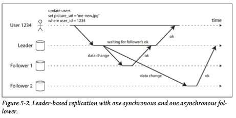

# Chapter 5. Replication

1. [Leaders and Followers](#Leaders-and-Followers)
   - [Synchronous Versus Asynchronous Replication](#Synchronous-Versus-Asynchronous-Replication)
   - [Setting Up New Folowers](#Setting-Up-New-Followers)
   - [Handling Node Outages](#Handling-Node-Outages)
   - [Implementation of Replication Logs](#Implementation-of-Replication-Logs)
2. [Problems with Replication Lag](#Problems-with-Replication-Lag)
   - [Reading Your Own Writes](#Reading-Your-Own-Writes)
   - [Monotonic Reads](#Monotonic-Reads)
   - [Consistent Prefix Reads](#Consistent-Prefix-Reads)
   - [Solutions for Replication Lag](#Solutions-for-Replication-Lag)
3. [Multi-Leader Replication](#Multi-Leader-Replication)
   - [Use Cases for Multi-Leader Replication](#Use-Cases-for-Multi-Leader-Replication)
   - [Handling Write Conflicts](#Handling-Write-Conflicts)
   - [Multi-Leader Replication Topologies](#Multi-Leader-Replication-Topologies)
4. [Leaderless Replication](#Leaderless-Replication)
   - [Writing to the Database When a Node Is Down](#Writing-to-the-Database-When-a-Node-Is-Down)
   - [Limitations of Quorum Consistency](#Limitations-of-Quorum-Consistency)
   - [Sloppy Quorums and Hinted Handoff](#Sloppy-Quorums-and-Hinted-Handoff) 
   - [Detecting Concurrent Writes](#Detecting-Concurrent-Writes)

 

Replication: keeping a copy of the same data on multiple machines that are connected via a network

- To keep data geographically close to your users
- To allow the system to continue working even if some of its parts have failed(and thus increase availability)
- To scale out the number of machines that can serve read queries (and thus increase read throughput)

**Topic**

- how to handle changes to replicated data
- popular algorithm for replicating changes: _single-leader, multi-leader, leaderless_
- trade-offs between algorithm
   - whether to use synchronous or asynchronous replication
   - how to handle failed replicas
   - eventual consistency
   - _read-your-writes_ and _monotonic reads_ guarantees

 

## Leaders and Followers

_replica_: each node that stores a copy of the database  
The most common solution for this is called: _leader-based replication (active/passive of master-slave replication)_  

1. One of the replicas is designated the _leader_ (for write)
2. The other replicas are known as _followers_ (for read) - whenever leader writes new data to its local storage, 
   it also sends the data change to all of its followers as part of _replication log_ or _change stream_.  
3. When a client wants to read from database, it can query either the leader or any of the followers, but only accepted by leader.

### Synchronous Versus Asynchronous Replication

Whether the replication happens _synchronously_ or _asynchronously_ is an important detail of a replicated system.  

Figure 5-2 is general case of replication.  
One for _synchronous_ and others for _asynchronous_.  

**Synchronous Replication**

- pros: follower is guaranteed to have an up-to-date copy of the data that is consistent with the leader.  
- cons: if the follower does not respond, writes cannot be processed and all the writes are blocked.  

**_Semi-Synchronous_**

- It is impractical for all followers to be synchronous
- _one_ of the followers is synchronous, and the others are asynchronous
- If the synchronous follower becomes unavailable or slow, one of the asynchronous followers is made synchronous
- up-to-date copy of data on at least two nodes

**Leader-based Replication with Fully Asynchronous**

- often case, widely used
- write is not guaranteed to be durable
- leader can continue process writes, even if all of its followers have fallen behind
- _chain replication_ to provide good performance and availability implemented in Microsoft Azure Storage

### Setting Up New Followers

Sometimes, we need to set up new followers - increase the number of replicase, or to replace failed nodes.  
Simply copying data could lead inconsistent data that every follower would see different points of database.  
You could use locking the database for consistency, but that would go against the goal of high availability.

**How can we set up new followers**

1. Take a consistent snapshot of the leader's database
2. Copy the snapshot to the new follower node
3. The follower connects to the leader and requests all the data changes that have happened since the snapshot was taken 
    - needs exact snapshot position (PostgresSql-_log sequence number_, MySQL-_binlog coordinates_)
4. When the follower has processed the backlog of data changes since the snapshot, we say it _caught up_

### Handling Node Outages

Let's see how to handle individual node failures to keep the impact of a node outage as small as possible for operations and maintainance.  

**Follower failure: Catch-up recover**

The follower can recover quite easily.  
It knows the last transaction that was processed before the fault occurred from the logs.  
The follower can connect to the leader and request all the data changes.  

**Leader failure: Failover**

Trickier problem:  1. one of the followers need to be promoted to be a new leader
2. clients need to be reconfigured to send their writes to the new leader, 
3. other followers need to start consuming data changes from the new leader.  

**Common automatic failover process**

1. _Determining that the leader has failed_.  
   - most system simply use a timeout
2. _Choosing a new leader_. 
   - appointed by a previously elected _controller node_
   - usually the replica with the most up-to-date data changes from the old leader
3. _Reconfiguring the system to use the new leader_.
   - If the old leader comes back, the system need to ensure to follower and recognize the new leader.  

**Points that can go wrong**

- In asynchronous replications, the new leader may not have received all the writes from the old leader before it failed.  
   - old leader's unreplicated writes to simply be discarded
   - may violate clients' durability expectations
- Discarding writes is especially dangerous if other storage systems outside the database need to be coordinated with the database contents.  
- _split brain_: It could happen that two nodes both believe that they are the leader.  
- What is the right timeout before the leader is declared dead?

### Implementation of Replication Logs

#### Statement-based replication

Leader logs every write request (_statements_) that it executes and sends that statement log to its followers.  
Followings are some problems that can break down:  
- Any statement that calls a nondeterministic functions(NOW(), RAND()) is likely to generate a differnet value on each replica
- In case of auto-incrementing columns, must be executed the same order on each replica.  
- Statements that have side effects may result in different side effects occurring on each replica.

#### Write-ahead log (WAL) shipping

- In case of a log-structured storage engine, this log is the main place for storage.  
- B-tree, which overwrites individual disk blocks, 
  every modification if first written to a write-ahead log so that the index can be stored to a consistent state after a crash.  
  
In either case, the log is an append-only sequence of bytes.  
Besides, writing the log to disk, the leader sends it across the network to its followers.  

Main disadvantage: log describes the data on a very low level

#### Logical (row-based) log replication

Use different log formats for replication and for the storage engine, 
which allows the replication log to be decoupled from the storage engine internals.  - _logical logs_

- more easily kept backward compatible, allowing the leader and the follower to run different versions of the database software
- easier for external applications to parse

#### Trigger-based replication

When you need flexibility 
- if you want to only replicate a subset of the data, replicate from one kind of database to another, if you need conflict resolution logic  
You can use _triggers and stored procedures_ for alternative.  
  
A trigger lets you register custom application code that is automatically executed when a data change.  
Trigger-based replication typically has greater overheads than other replication methods, but it's very useful due to its flexibility.  

 

## Problems with Replication Lag

Leader-based replication

- all writes to go through a single node, but read only queries can go to any replica
- In _read-scaling_ architecture, just increase the capacity for service read-only requests simply by adding more followers
- However, this approach only realistically works with **asynchronous replication** not **synchronous replication** case
- Unfortunately, in case of asynchronous follower, it may see outdated information if the follower has fallen behind

_eventually consistency_: temporary inconsistency in case of asynchronous followers, eventually the followers catch up if you stop writing database and wait  
_the replication lag_: the delay between a write happening on the leader and being reflected on a follower

When the lag is so large, the inconsistencies it introduces are not just a theoretical issue but a real problem for applications.  

### Reading Your Own Writes

### Monotonic Reads

### Consistent Prefix Reads

### Solutions for Replication Lag

## Multi Leader Replication

### Use Cases for Multi Leader Replication

### Handling Write Conflicts

### Multi Leader Replication Topologies

## Leaderless Replication

### Writing to the Database When a Node Is Down

### Limitations of Quorum Consistency

### Sloppy Quorums and Hinted Handoff

### Detecting Concurrent Writes

