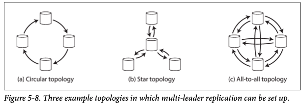

# Chapter 5. Replication

1. [Leaders and Followers](#Leaders-and-Followers)
   - [Synchronous Versus Asynchronous Replication](#Synchronous-Versus-Asynchronous-Replication)
   - [Setting Up New Folowers](#Setting-Up-New-Followers)
   - [Handling Node Outages](#Handling-Node-Outages)
   - [Implementation of Replication Logs](#Implementation-of-Replication-Logs)
2. [Problems with Replication Lag](#Problems-with-Replication-Lag)
   - [Reading Your Own Writes](#Reading-Your-Own-Writes)
   - [Monotonic Reads](#Monotonic-Reads)
   - [Consistent Prefix Reads](#Consistent-Prefix-Reads)
   - [Solutions for Replication Lag](#Solutions-for-Replication-Lag)
3. [Multi-Leader Replication](#Multi-Leader-Replication)
   - [Use Cases for Multi-Leader Replication](#Use-Cases-for-Multi-Leader-Replication)
   - [Handling Write Conflicts](#Handling-Write-Conflicts)
   - [Multi-Leader Replication Topologies](#Multi-Leader-Replication-Topologies)
4. [Leaderless Replication](#Leaderless-Replication)
   - [Writing to the Database When a Node Is Down](#Writing-to-the-Database-When-a-Node-Is-Down)
   - [Limitations of Quorum Consistency](#Limitations-of-Quorum-Consistency)
   - [Sloppy Quorums and Hinted Handoff](#Sloppy-Quorums-and-Hinted-Handoff) 
   - [Detecting Concurrent Writes](#Detecting-Concurrent-Writes)

 

Replication: keeping a copy of the same data on multiple machines that are connected via a network

- To keep data geographically close to your users
- To allow the system to continue working even if some of its parts have failed(and thus increase availability)
- To scale out the number of machines that can serve read queries (and thus increase read throughput)

**Topic**

- how to handle changes to replicated data
- popular algorithm for replicating changes: _single-leader, multi-leader, leaderless_
- trade-offs between algorithm
   - whether to use synchronous or asynchronous replication
   - how to handle failed replicas
   - eventual consistency
   - _read-your-writes_ and _monotonic reads_ guarantees

 

## Leaders and Followers

_replica_: each node that stores a copy of the database  
The most common solution for this is called: _leader-based replication (active/passive of master-slave replication)_  

1. One of the replicas is designated the _leader_ (for write)
2. The other replicas are known as _followers_ (for read) - whenever leader writes new data to its local storage, 
   it also sends the data change to all of its followers as part of _replication log_ or _change stream_.  
3. When a client wants to read from database, it can query either the leader or any of the followers, but only accepted by leader.

### Synchronous Versus Asynchronous Replication

Whether the replication happens _synchronously_ or _asynchronously_ is an important detail of a replicated system.  

Figure 5-2 is general case of replication.  
One for _synchronous_ and others for _asynchronous_.  

**Synchronous Replication**

- pros: follower is guaranteed to have an up-to-date copy of the data that is consistent with the leader.  
- cons: if the follower does not respond, writes cannot be processed and all the writes are blocked.  

**_Semi-Synchronous_**

- It is impractical for all followers to be synchronous
- _one_ of the followers is synchronous, and the others are asynchronous
- If the synchronous follower becomes unavailable or slow, one of the asynchronous followers is made synchronous
- up-to-date copy of data on at least two nodes

**Leader-based Replication with Fully Asynchronous**

- often case, widely used
- write is not guaranteed to be durable
- leader can continue process writes, even if all of its followers have fallen behind
- _chain replication_ to provide good performance and availability implemented in Microsoft Azure Storage

### Setting Up New Followers

Sometimes, we need to set up new followers - increase the number of replicase, or to replace failed nodes.  
Simply copying data could lead inconsistent data that every follower would see different points of database.  
You could use locking the database for consistency, but that would go against the goal of high availability.

**How can we set up new followers**

1. Take a consistent snapshot of the leader's database
2. Copy the snapshot to the new follower node
3. The follower connects to the leader and requests all the data changes that have happened since the snapshot was taken 
    - needs exact snapshot position (PostgresSql-_log sequence number_, MySQL-_binlog coordinates_)
4. When the follower has processed the backlog of data changes since the snapshot, we say it _caught up_

### Handling Node Outages

Let's see how to handle individual node failures to keep the impact of a node outage as small as possible for operations and maintainance.  

**Follower failure: Catch-up recover**

The follower can recover quite easily.  
It knows the last transaction that was processed before the fault occurred from the logs.  
The follower can connect to the leader and request all the data changes.  

**Leader failure: Failover**

Trickier problem:  1. one of the followers need to be promoted to be a new leader
2. clients need to be reconfigured to send their writes to the new leader, 
3. other followers need to start consuming data changes from the new leader.  

**Common automatic failover process**

1. _Determining that the leader has failed_.  
   - most system simply use a timeout
2. _Choosing a new leader_. 
   - appointed by a previously elected _controller node_
   - usually the replica with the most up-to-date data changes from the old leader
3. _Reconfiguring the system to use the new leader_.
   - If the old leader comes back, the system need to ensure to follower and recognize the new leader.  

**Points that can go wrong**

- In asynchronous replications, the new leader may not have received all the writes from the old leader before it failed.  
   - old leader's unreplicated writes to simply be discarded
   - may violate clients' durability expectations
- Discarding writes is especially dangerous if other storage systems outside the database need to be coordinated with the database contents.  
- _split brain_: It could happen that two nodes both believe that they are the leader.  
- What is the right timeout before the leader is declared dead?

### Implementation of Replication Logs

#### Statement-based replication

Leader logs every write request (_statements_) that it executes and sends that statement log to its followers.  
Followings are some problems that can break down:  
- Any statement that calls a nondeterministic functions(NOW(), RAND()) is likely to generate a differnet value on each replica
- In case of auto-incrementing columns, must be executed the same order on each replica.  
- Statements that have side effects may result in different side effects occurring on each replica.

#### Write-ahead log (WAL) shipping

- In case of a log-structured storage engine, this log is the main place for storage.  
- B-tree, which overwrites individual disk blocks, 
  every modification if first written to a write-ahead log so that the index can be stored to a consistent state after a crash.  
  
In either case, the log is an append-only sequence of bytes.  
Besides, writing the log to disk, the leader sends it across the network to its followers.  

Main disadvantage: log describes the data on a very low level

#### Logical (row-based) log replication

Use different log formats for replication and for the storage engine, 
which allows the replication log to be decoupled from the storage engine internals.  - _logical logs_

- more easily kept backward compatible, allowing the leader and the follower to run different versions of the database software
- easier for external applications to parse

#### Trigger-based replication

When you need flexibility 
- if you want to only replicate a subset of the data, replicate from one kind of database to another, if you need conflict resolution logic  
You can use _triggers and stored procedures_ for alternative.  
  
A trigger lets you register custom application code that is automatically executed when a data change.  
Trigger-based replication typically has greater overheads than other replication methods, but it's very useful due to its flexibility.  

 

## Problems with Replication Lag

Leader-based replication

- all writes to go through a single node, but read only queries can go to any replica
- In _read-scaling_ architecture, just increase the capacity for service read-only requests simply by adding more followers
- However, this approach only realistically works with **asynchronous replication** not **synchronous replication** case
- Unfortunately, in case of asynchronous follower, it may see outdated information if the follower has fallen behind

_eventually consistency_: temporary inconsistency in case of asynchronous followers, eventually the followers catch up if you stop writing database and wait  
_the replication lag_: the delay between a write happening on the leader and being reflected on a follower

When the lag is so large, the inconsistencies it introduces are not just a theoretical issue but a real problem for applications.  

### Reading Your Own Writes

When new data is submitted, it must be sent to the leader and when the user views the data, it can be read from a follower.  
In asynchronous replication, the new data may not yet have reached the replica.  
In this situation, we need _read-after-write consistency_, also known as _read-your-writes-consistency_.  

There are various possible techniques:  
1. when reading something that the user may have modified, read it from leader; otherwise, read it form a follower
   - you have some way of knowing whether something might have been modified, without querying it
   - ex. read user's profile from leader, and other's profile with followers
   - can negate the benefit of read scaling
2. other criteria whether to read from the leader
   - ex. one minute after the last update, monitor the replication lag on followers and prevent queries on any follower that is more than one minute behind the leader
3. remember the timestamp of its most recent write
   - ensure that the replica serving any reads for that user reflects updates at least until that timestamp(_logical timestamp_)
    
Another complication arises when the same user is accessing your service with multiple device.  
In this case, you may want to provide _cross-device_ read-after-write consistency.  
You have to consider additional issues: 
- The metadata that updates have happened on the other device need to be centralized.  
- If replicas are distributed across different datacenters, there is no guarantee that the connections will be routed to the same datacenter
   - need to route requests from all of a user's devices to the same datacenter 

### Monotonic Reads

Monotonic reads: a guarantee that this kind of anomaly does not happen.  

If a user makes a several reads from different replicas, it can cause _moving backward in time_.  
ex. First, read data that catched up and read data from other replica next time that catch up was not succeeded.  

One way of achieving monotonic reads is to make sure that each user always makes their reads from the same replica.

### Consistent Prefix Reads

Concerns about violation of causality  
If some partitions are replicated slower than others, an observer may seed the answer before they see the question.  

Preventing this kind of anomaly requires another type of guarantee: _consistent prefix reads_  
If the database always applies writes in the same order, reads always see a consistent prefix, so this anomaly cannot happen.  
However, many distributed databases, different partitions operate independently, so there is no global ordering of writes.  
One solution is to make sure that ay writes that are causally related to each other are written to the same partition.

### Solutions for Replication Lag

_transactions_: they are a way for a database to provide stronger guarantees so that the application can be simpler.  
However, in the move to distributed databases, many systems have abandoned them, 
claiming that transaction are too expensive in terms of performance and availability, 
and asserting that eventual consistency is inevitable in a scalable system.  

topic transactions -> chap 7, 9  
alternative mechanisms -> Part III

 

## Multi Leader Replication

major downside of leader-based replication: there is only one leader, and all writes must go through it

_multi-leader_ configuration (also known as _master-master_ or _active/active replication_: 
A natural extension of the leader-based replication model is **to allow more than one node to accept writes**.

### Use Cases for Multi Leader Replication

#### Multi-datacenter operation

In a multi-leader configuration, you can have a leader in each datacenter.  
Between datacenters, each datacenter's leader replicates its changes to the leaders in other datacenters.  

_Performance_  
- every write can be processed in the local datacenter and is replicated asynchronously
- inter-datacenter network delay is hidden from users, which means the perceived performance may be better

_Tolerance of datacenter outages_  
- each datacenter can continue operating independently even though failover occurs

_Tolerance of network problems_
- a temporary network interruption does not prevent writes being processed  

Downside of multi-leader replication:  
- same data may be concurrently modified in two different datacenters, and those write conflicts must be resolved
- auto-incrementing keys, triggers, and integrity constraints  

-> multi-leader replication is often considered dangerous territory that should be avoided if possible.  

#### Clients with offline operation

Multi-leader replication is appropriate if you have an application that needs to continue to work while it ti disconnected from the internet.  
In this case, every device has a local database that acts as a leaders, 
and there is an asynchronous multi-leader replication process.  

#### Collaborative editing

_Real-time collaborative editing_ allows several people to edit a document simultaneously.  

When one user edits a document, the changes are instantly applied to their local replica 
and asynchronously replicated to the server and any other users who are editing the same document.  

If you want to guarantee that there will be no editing conflicts, 
the application must obtain a lock on the document before a user can edit it 
which is just equal to single-leader replication.  
For faster collaboration, make the unit of change very small and avoid locking.  

### Handling Write Conflicts

The biggest problem with multi-leader replication: write conflicts can occur, which means that conflict resolution is required.  
When the changes are asynchronously replicated, a conflict is detected.  
This problem does not occur in a single-leader database.

#### Synchronous versus asynchronous conflict detection

- make the conflict detection synchronous
    - wait for the write to be replicated to all replicas before telling the user that the write was successful.  
    - lose the main advantage of multi-leader replication
- just use single-leader replication

#### Conflict avoidance

- ensure that all writes for a particular record go through the same leader, then conflicts cannot occur
- avoiding conflicts is a frequently recommended approach

#### Converging toward a consistent state

A single-leader database case:  
database applies writes in a sequential order

Multi-leader configuration:  
no defined ordering of writes, so it's not clear what the final value should be  

Database must resolve the conflict in a _convergent_ way which means that all replicas must arrive at the same final value 
when all changes have been replicated.  
Various ways of achieving convergent conflict resolution:  

1. Give each write a unique ID, and use timestamp for _last write wins_.  Popular but it is dangerously prone to data loss
2. Give each replica a unique ID, and originate a higher numbered replica always take precedence over writes  
3. Merge the value together - concatenate
4. Record the conflict in an explicit data structure and write application code that resolves the conflict at some later time

#### Custom conflict resolution logic

_On write_: as soon as the database system detects a conflict in the log of replicated changes, it calls the conflict handler  
_On read_: when a conflict is detected, all the conflicting writes are stored and prompt the user or automatically resolve the conflict

#### Automatic Conflict Resolution

- _Conflict-free replicated datatypes_(CRDTs) 
  - automatically resolve conflicts in sensible ways. (Riak 2.0)
- _Mergeable persistent data structures_
    - track history explicitly, and use a three-way merge function (CRDTs use two-way merge function)
- _Operational transformation_
    - used in collaborative editing applications

### Multi Leader Replication Topologies

_replication topology_ describes teh communication paths along which writes are propagated from one node to another.  

_circular topology & star topology_

- MySQL default supports circular topology
- nodes need to forward data changes they receive from other nodes
- cons: if just one node fails, it can interrupt the flow of replication message between other nodes

_all-to-all_  

- most general topology
- every leader sends its writes to every other leader
- some network links may be faster than oters -> writes may arrive in the wrong order at some replicas
- to order events correctly, a technique called _version vectors_ can be used

## Leaderless Replication

Some data storage systems take a different approach, abandoning the concept of a leader 
and allowing any replica to directly accept writes from clients(leaderless).  
: _Dynamo-style_

- used by Dynamo, Riak, Cassandra, Voldemort

### Writing to the Database When a Node Is Down

In a leaderless configuration, failover does not exist.  
The client sends write to some replicas in parallel, and sends read request to several nodes in parallel.  

**_Read repair and anti-entropy_**

After an unavailable node comes back online, how does it catch up on the writes that it missed?

1. _Read repair_

The stale responses can be detected when a client makes a read from several nodes is parallel.  
This approach works well for values that are frequently read.  

2. _Anti-entropy process_

Some datastores have a background process that constantly looks for differences in the data between replicas 
and copies any missing data from one replica to another.  
Without an anti-entropy process, values that are rarely read may be missing.  

**_Quorums for reading and writing_**

If there are _n_ replicas, every write must be confirmed by _w_ nodes to be considered successful, and we must at least _r_ nodes for each read.  

_w + r > n_  
-> we expect to get an up-to-date value when reading  
Reads and writes that obey these _r_ and _w_ values are called _quorum_ reads and writes.  

Commonly, _n_ is an odd number, _w_ = _r_ = _(_n_ + 1)/2 (rounded up)  

Normally, read and writes are always sent to all _n_ replicas in parallel.  
The parameter _w_ and _r_ determine how many nodes we wait for.

### Limitations of Quorum Consistency

In case of _w + r <= n_,  
reads and writes will still be sent to _n_ nodes, but a smaller number of successful responses is required for the operation to succeed.  
It's more likely that our read didn't include the node with the latest value, 
but this configuration allows lower latency and higher availability.  

edge cases where stale values are returned

- w writes may end up on different nodes that the r reads : no guaranteed overlap
- not clear which one happened first -> safe solution to merge the concurrent writes
- if a write happens concurrently with a read
- if a write succeeded on some replicas but failed on others

Stronger guarantees generally require transactions or consensus.

#### Monitoring staleness

Even if your application can tolerate stale reads, you need to be aware of the health of your replication.  
In systems with leaderless replication, there is no fixed order in which writes are applied, which makes monitoring more difficult.  
- unfortunately not yet common practice... 

### Sloppy Quorums and Hinted Handoff

#### Multi-datacenter operation

### Detecting Concurrent Writes

#### Last writes wins (discarding concurrent writes)

#### The "happens-before" relationship and concurrency

#### Capturing the happens-before relationship

#### Merging concurrently written values

#### Version vectors

