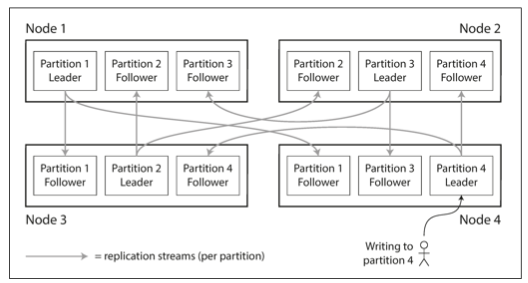

# Chapter 6. Partitioning

1. [Partitioning and Replication](#Partitioning-and-Replication)
2. [Partitioning of Key Value Data](#Partitioning-of-Key-Value-Data)
    - [Partitioning by Key Range](#Partitioning-by-Key-Range)
    - [Partitioning by Hash of Key](#Partitioning-by-Hash-of-Key)
    - [Skewed Workloads and Relieving Hot Spots](#Skewed-Workloads-and-Relieving-Hot-Spots)
3. [Partitioning and Secondary Indexes](#Partitioning-and-Secondary-Indexes)
   - [Partitioning Secondary Indexes by Document](#Partitioning-Secondary-Indexes-by-Document)
   - [Partitioning Secondary Indexes by Term](#Partitioning-Secondary-Indexes-by-Term)
4. [Rebalancing Partitions](#Rebalancing-Partitions)
   - [Strategies for Rebalancing](#Strategies-for-Rebalancing)
   - [Operations Automatic or Manual Rebalancing](#Operations-Automatic-or-Manual-Rebalancing)
5. [Request Routing](#Request-Routing)
   - [Parallel Query Execution](#Parallel-Query-Execution)

 

The main reason for wanting to partition data is _scalability_.  
Different partition can be placed on different nodes in a shared-nothing cluster.  
Complex queries can potentially be parallelized across many nodes.  

In this chapter, we will look at  
1. different approaches for partitioning large datasets
2. observe how the indexing of data interacts with partitioning
3. rebalancing - necessary if you want to add or remove nodes
4. overview of how databases route requests to the right partitions and execute queries  

  

## Partitioning and Replication

Partitioning is usually combined with replication so that copies of each partition are stored on multiple nodees.  
It may still be stored on different nodes for fault tolerance.  

In a leader-follower replication model,  
each partition's leader is assigned to one node, and its followers are assigned to other nodes.  

## Partitioning of Key Value Data

Our goal with partitioning is to spread the data, and the query load evenly across nodes.  

_skewed_: some partitions have more data or queries than others  
_hot spot_: A partition with disproportionately high load   

If you assign records randomly,  
the big disadvantage is when you're trying to read a particular item, you have no way of knowing which node it is on, so you have to query all nodes in parallel.  

If you have a simple key-value data model,  
since all alphabetically sorted by title, you can quickly find the one you're looking for.  

### Partitioning by Key Range

One way of partitioning is to assign a continuous range of keys to each partition.  
If you know the boundaries between the ranges, you can easily determine which partition contains a given key.  

The ranges of keys are not necessarily evenly spaced, because your data may not be evenly distributed.  
So, the partition boundaries need to adapt to the data.  

For example, consider an application that stores data from a network fof sensors, where the key is the timestamp of the measurement.  

**Advantage**

- range scans are easy, 
- you can treat the key as a concatenated index in order to fetch several related records in one query.  

**Disadvantage**

- certain access patterns can lead to hot spots 
   - if we write data from the sensors to the databases as the measurements happen
   - all the writes end up going to the same partition

To avoid this problem, you need to use something other than timestamp.  
For example, you could prefix each timestamp with the sensor name.  
Then, when you want to fetch the values of multiple sensors within a time range, you need to perform a separate range query for each sensor name.  

### Partitioning by Hash of Key

Because of risk of skew and hot spots, many distributed datastores use a hash function to determine the partition for a given key.  
A good hash function takes skewed data and makes it uniformly distributed.  

**Advantage** 

- _consistent hashing_ : The partition boundaries can be evenly spaced, or they can be chosen pseudorandomly  

**Disadvantage**

- lose a nice property of key-range partitioning 

In case of Cassandra to compromise between the two partitioning strategies,  
it uses a tables declared with a _compound primary key_ consisting of several columns.  
Only first part of that key is hashed to determine the partition, but the other columns are used a sa concatenated index for sorting the data.  

If it specifies a fixed value for the first column, it can perform an efficient range scan over the otehr columns of the key.  
The concatenated index approach enables an elegant data model for one-to-many relationships.

### Skewed Workloads and Relieving Hot Spots

Hashing a key to determine its partition can help reduce hot spots.  
However, it can't avoid them entirely: in extreme case where all reads and writes are for the same key,  
you still end up with all requests being routed to the same partition.  
Therefore, hashing the key doesn't help.  

Today, most data systems are not able to automatically compensate for such a highly skewed workload.  
So, it's the responsibility of the application to reduce the skew.  
A simple technique is to add a random number to the beginning or end of the key.  
However, having split the writes across different keys, any reads now have to do additional work,  
as they have to read the data from all keys and combine it.

## Partitioning and Secondary Indexes

A secondary index usually doesn't identify a record uniquely but rather is a way of searching for occurrences of a particular value.  
Many key-value stores have avoided secondary indexes because of their added implementation complexity,  
but some have started adding them because they are so useful for data modeling.  

Problem with secondary indexes is that they don't map neatly to partitions.  
Therefore, there are two main approaches:  
1. document-based partitioning
2. term-based partitioning

### Partitioning Secondary Indexes by Document

Each partition maintains its own secondary indexes, covering only the documents in that partition.  
For that reason, a document-partitioned index is also known as a _local index_.  

You need to send the query to _all_ partitions, and combine all the results you get back.  
This approach to querying a partitioned database is sometimes knows ans _scatter/gather,  
and it can make read queries on secondary indexes quite expensive.

### Partitioning Secondary Indexes by Term

Rather than each partition having its own secondary index (_a local index),  
we can construct a _global index_ that covers data in all partitions.  

_term-partitioned_: the term we're looking for determines the partition fo the index 

**Advantage**

- useful for range scans
    - vs partitioning on a hash of the term gives a more even distribution of load
- reads more efficient
    - a client only needs to make a request to the partition containing the term that it wants

**Disadvantage**

- slower and more complicated
- require a distributed transaction across all partitions affected by a write
    - not supported in all databases
    - In practice, updates to global secondary indexes are often asynchronous

## Rebalancing Partitions

Things change in a database: 

• The query throughput increases, so you want to add more CPUs to handle the load.
• The dataset size increases, so you want to add more disks and RAM to store it.
• A machine fails, and other machines need to take over the failed machine’s responsibilities.

_rebalancing_: the process of moving load from one node in cluster to another

### Strategies for Rebalancing

#### How not to do it: hash modd N

If the number of nodes _N_ changes, most of the keys will need to be moved from one node to another.  

#### Fixed number of partitions 

Create many more partitions than there are nodes, and assign several partitions to each node.  
If a node is added to the cluster, the new node can _steal_  a few partitions from every existing node until partitions are fairly distributed again.  
The number of partitions does not change, nor does the assignment of keys to partition to nodes.  
The only thing that changes is the assignment of partitions to nodes.  

Choosing the right number of partitions is difficult if the total size of the dataset is highly variable.  
If partitions are very large, rebalancing and recovery from node failures become expensive.  
The best performance is achieved when the size of partitions is "just right".  

#### Dynamic partitioning

A fixed number of partitions with fixed boundaries would be very inconvenient:  
if you got the boundaries wrong, you could end up with all data in one partitions empty.  
Reconfiguring the partition boundaries manually would be very tedious.  
ex. HBase, RethinkDB

partition grows and exceed a configured size -> split into two partitions  
lots of data is deleted, and a partition shrinks below threshold -> merged with an adjacent partition  
This process is similar to what happens at the top level of a B-tree.  

**Advantage**

- the number of partitions adapts to the total data volume

**Disadvantage**

- an empty databases starts off with a single partition
- there is no _a priori_ information about where to draw the partition boundaries

_pre-splitting_: HBase and MongoDB allow an initial set of partitions to be configured on an empty database

Dynamic partitioning is suitable for both key range-partitioned data and hash-partitioned data.  

#### Partitioning proportionally to nodes

For third option, Cassandra and Ketama supports to make the number of partitions proportional to the number of nodes.  
- in other words, to have a fixed number of partitions _per node_.  
Since a larger data volume generally requires many nodes to store, this approach also keeps the size of each partition fairly stable.  

Picking partition boundaries randomly requires that hash-based partitioning is used.  
Indeed, this approach corresponds most closely to the original definition of consistent hashing.  

### Operations Automatic or Manual Rebalancing

Does the rebalancing happen automatically or manually?

**Advantage of Fully automated rebalancing**

- convenient, less operational work to do for normal maintenance

**Critical Disadvantage of Fully automated rebalancing**

- unpredictable
- rebalancing is an expensive operation 
  - requires rerouting requests and moving a large amount of data from one node to another
- overload the network or the nodes and harm the performance of other request while the rebalancing is in progress
- dangerous in combination with automatic failure detection
  - if node is overloaded and is temporarily slow, the other nodes can conclude that the overloaded node is dead, 
    therefore, automatically rebalance the cluster to move load away from it

For that reason, it can be a good thing to have a human in the loop for rebalancing.  

 

## Request Routing

_service discovery_ problem:  

When a client wants to make a request, how does it know which node to connect to?  
As partitions are rebalanced, the assignment of partitions to nodes changes.  

**Approaches to this problem**

1. Allow clients to contact any node - forwards request to the appropriate node, receives the reply, and passes the reply along to the client
2. Send all requests from clients to routing tier first
3. Require that clients be aware of the partitioning, and the assignment of partitions to nodes

In all cases, the key problem is: how does the component making the routing decision  
which is a challenging problem.  

**Way 1. Use separate coordination service**

Zookeeper

- keep track of the cluster metadata
- maintains the authoritative mapping of partitions to nodes
- whenever a partition changes ownership, ZooKeeper notifies the routing tiers so that it can keep its routing information up to date 

HBase, SolrCloud, Kafka use Zookeeper  
MongoDB use its own _config server_ and _mongos_ daemons as the routing tier

**Way 2. Use _gossip protocol_**

Cassandra and Riak use a _gossip protocol_ among the nodes to disseminate any changes in cluster state.  
Requests can be sent to any node, and that node forwards them to the appropriate node for the requested partition.  
This model puts more complexity in the database nodes but avoids the dependency on an external coordination service such as Zookeeper.  

**Way 3. Does not rebalance automatically**

Couchbase does not rebalance automatically.  
It is configured with a routing tier called _moxi_.

 

In addition, when using a routing tier or when sending requests to a random node,  
clients still need to find the IP addresses to connect to.  
Therefore, the DNS could be sufficient to use.  

### Parallel Query Execution

All of the examples above was very simple queries that is supported by most NoSQL distributed datastores.  

However, _massive parallel processing(MPP)_ relational database product which is often used for analytics,  
are much more sophisticated in the types of queries they support.  
The MPP query optimizer breaks this complex query into a number of execution stages and partitions,  
many of which can be executed in parallel on different nodes of the database cluster.  
Queries that involve scanning over large parts of the dataset particularly benefit from such parallel execution.  

