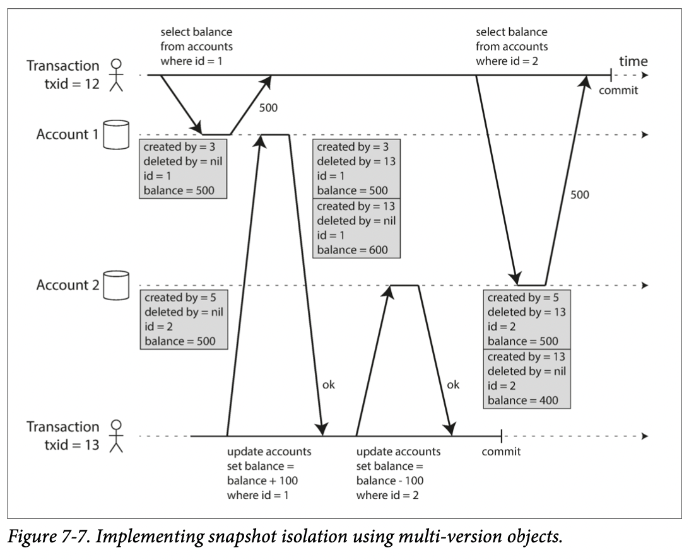

# Chapter 7. Transactions

1. [The Slippery Concept of a Transaction](#The-Slippery-Concept-of-a-Transaction)
    - [The Meaning of ACID](#The-Meaning-of-ACID)
    - [Single Object and Multi Object Operations](#Single-Object-and-Multi-Object-Operations)
2. [Weak Isolation Levels](#Weak-Isolation-Levels)
    - [Read Committed](#Read-Committed)
    - [Snapshot Isolation and Repeatable Read](#Snapshot-Isolation-and-Repeatable-Read)
    - [Preventing Lost Updates](#Preventing-Lost-Updates)
    - [Write Skew and Phantoms](#Write-Skew-and-Phantoms)
3. [Serializability](#Serializability)
    - [Actual Serial Execution](#Actual-Serial-Execution)
    - [Two Phase Locking (2PL)](#Two-Phase-Locking-(2PL))
    - [Serializable Snapshot Isolation (SSI)](#Serializable-Snapshot-Isolation-(SSI))

 

In the harsh reality of data systems, many things can go wrong.  
For decades, _transactions_ have been the mechanism of choice for simplifying these issues.

**_Transactions_**: a way for an application to group several reads and writes together into a logical unit.  

Transactions are not a law of nature; they were created with a purpose, namely to _simplify the programming model_ for applications accessing a database. 
By using transactions, the application is free to ignore certain potential error scenarios and concurrency issues, 
because the database takes care of them instead(_safety guarantees_).  

We will go deep in the area of concurrency control, discussing various kinds of race conditions 
that can occur and how databases implement isolation levels such as _read committed, snapshot isolation, and serializabiltiy_. 

## The Slippery Concept of a Transaction

Almost all relational databases, and some nonrelational databases, support transactions.  
Most of them follow the style of IBM System R introduced in 1975.

In the late 2000s, nonrelational databases started gaining popularity.  
Many of this new generation of databases abandoned transactions entirely, 
or redefined the word to describe a much weaker set of guarantees than had previously been understood.  

Like every other technical design choice, transactions have advantages and limitations.  
There are two view points of transactions,  
- any large-scale system would have to abandon transactions to maintain good performance and high availabilty
- transactional guarantees are an essential requirement for "serious application" with "valuable data"

### The Meaning of ACID

ACID, stands for _Atomicity, Consistency, Isolation, and Durability_.  
It was coined in 1983 by Theo Harder and Andreas Reuter to establish precise teminology for fault-tolerance mechanisms in databases.  
However, in practice, one database's implementation of ACID does not equal another's implementation.  
There is a lot of ambiguity around the meaning of _isolation_.  

#### Atomicity

In general, _atomic_ refers to something that cannot be broken down into smaller parts.  
ACID atomicity describes what happens if a client wants to make several writes, but a fault occurs after some of the writes have been processed.  
If the writes are grouped together into an atomic transaction, and the transaction cannot be completed(_committed_) due to a fault, 
than the transaction is _aborted_ and database must discard or undo any writes it has made.  

Atomicity simplifies this problem: if a transaction was aborted, the application can be sure that it didn't change anything, so it can safely be retired.  

#### Consistency

In the context of ACID, _consistency_ refers to an application-specific notion of the database being in a "good state.".  
Therefore, you have certain statements about your data(_invariants_) that must always be true.  

However, this idea of consistency depends on the application's notions of invariants, 
and it's the application's responsibility to define its transactions correctly so that they preserve consistency.  

Atomicity, isolation, and durability are properties of the database, whereas consistency (in the ACID sense) is a property of the application.  

#### Isolation

Most databases are accessed by several clients at the same time.  
If they are accessing the same database records, you can run into concurrency problems (race conditions).  

_Isolation_ is the sense of ACID means that concurrently executing transactions are isolated from each other: they cannot step on each other's toes.  
The classic database textbooks formalize isolation as _serializability_:  
each transaction can pretend that it is the only transaction running on the entire database.  

However, in practice, serializable isolation is rarely used, because it carries a performance penalty.  
Some popular databases, such as Oracle 11g, don't even implement it.  
There is an isolation level called "serializable", which actually implements something called _snapshot isolation_.

#### Durability

_Durability_ is the promise that once a transaction has committed successfully, 
any data it has written will not be forgotten, even if there is a hardware fault, or the database crashes.  

In a single-node database, durability means that the data has been written to nonvolatile storage.  
In a replicated database, durability many mean that data has been successfully copied to some number of nodes.  
In order to provide a durability guarantee, a database must wait until this writes or replications are complete before reporting a transaction as successfully committed.  

### Single Object and Multi Object Operations

_Multi-object_ are often needed if several pieces of data need to kept in sync.  
Isolation would have prevented this issue by ensuring multiple pieces of data to be updated in set.  

Multi-object transactions require some way of determining which read and write operations belong to the same transaction.  
In relational databases, that is typically done based on the client's TCP connection to the database server:  
on any particular connection, everything between a BEGIN TRANSACTION and a COMMIT statement is considered to be part of the same transaction.  

On the other hand, many nonrelational databases don't have such a way of grouping operations together.  
Even if there is a multi-object API, that doesn't mean it has transaction semantincs:  
the command may succeed for some keys and fail for others, leaving the database in a partially updated state.  

#### Single-object writes

Atomicity and isolation also apply when a single object is being changed.  
Atomicity can be implemented using a log for crash recovery, and isolation can be implemented using a lock on each object.  

Some databases also provide more complex atomic operations, such as an increment operation, 
which removes the need for a read-modify-write cycle.  
Similarly, popular is a compare-and-set operation, which allows a write to happen only if the value has not been concurrently changed by someone else.  

A transaction is usually understood as a mechanism for grouping multiple operations on multiple objects into one unit of execution.  

#### The need for multi-object transactions

There is nothing the fundamentally prevents transactions in a distributed database.  
However, in many other cases writes to several objects need to be coordinated:  

- When a row in one table which has foreign key reference to a row in another table in a relational model 
- When denormalized information needs to be updated in a document data model
- When indexes need to be updated everytime you change a value in databases with secondary indexes

#### Handling errors and aborts

A key feature of a transaction is that it can be aborted and safely retried if an error occurred.
Although retrying an aborted transaction is a simple and effective error handling mechanism, it isn't perfect:  

- If transaction succeeded, but network failed while the server tried to ack to client - perform twice
- If the error is due to overload, retrying the transaction will make the problem worse - you have to limit the number of retries, use exponential backoff, and handle overload-related errors differently from other errors
- If the transaction also has side effects outside the database - to make sure that several systems either commit or abort together, two-phase commit can help

So, not all systems follow this error handling.  
Datastores with leaderless replication work much more on a "best effort" basis.  
In case of popular object-relational mapping(ORM) frameworks such as Rail's ActiveRecord and Django don't retry aborted transactions.

## Weak Isolation Levels

Concurrency bugs are hard to find by testing, because such bugs are only triggered when you get unlucky with the timing.  
Having many concurrent users makes it much harder to develop applications, 
so databases have long tried to hide concurrency issues from application developers by providing _transaction isolation_.  

In practice, isolation is unfortunately not that easy.  
Serializable isolations has a performance cost, therefore, common for systems to use weaker levels of isolation, which protect against some concurrency issues, but not all.  

Even many popular relational database systems use weak isolation, 
they wouldn't necessarily have prevented these bugs from occurring.  
Therefore, rather than blindly relying on tools, we need to develop a good understanding of the kinds of concurrency problems that exist, and how to prevent them.  

We will learn:  

- isolation levels that are used in practice
- what kinds of race conditions can cannot occur
- serializability in detail

### Read Committed

The most basic level of transaction isolation is _read committed_.  
It makes two guarantees: _no dirty reads, no dirty writes_

#### No dirty reads

_dirty read_: if a transaction has not yet committed or aborted, but another transaction could see that uncommitted data

Any writes by a transaction only become visible to others when that transaction commits.  
It is useful for below reasons:  

- Seeing the database in a partially updated state is confusing to users and many cause other transactions to take incorrect decisions
- If a transaction aborts, any writes it has made need to be rolled back

#### No dirty writes

_dirty writes_: If the earlier write is part of transaction that has not yet committed, so that later write overwrites an uncommitted value

By preventing dirty writes, it can avoid below kinds of concurrency problems:  

- If transactions update multiple objects, dirty writes can lead to a bad outcome. 
- Make data updates safe

#### Implementing read committed

Read committed is a very popular isolation level.  
It is default setting in Oracle 11g, PostgreSQL, SQL Server 2012, MemSQL, and many other databases.  

Most commonly, databases prevent dirty writes by using row-level locks:  
must first acquire a lock on that object.  
Therefore, only one transaction can hold the lock for any given objects.  

However, the approach of requiring read locks does not work well in practice, 
because one long-running write transaction can force many read-only transactions to wait until the long-running transaction has completed.  
This harms the response time of read-only transactions and is bad for operabiltiy.  

For that reason, the database remembers both old and new value.  
While the transaction is ongoing, any other transactions that read the object are simply given the old value.  

### Snapshot Isolation and Repeatable Read

Even though you can get much stronger guarantees by using the read committed isolation, 
you can meet anomaly called a _nonrepeatable read_ or _read skew_:  
user can see different value that in previous query.  

In user case, this is not a lasting problem.  
However, some situations cannot tolerate such temporary inconsistency:  

- _Backups_: end up with some parts of the backup containing an older version of data
- _Analytic queries and integrity checks_: return nonsensical results if they observe parts of the database at different points in time. 

_Snapshot isolation_ is the most common solution to this problem.  
This idea is that each transaction reads from a _consistent snapshot_ of the database.  
Even if the data is subsequently changed by other transaction, each transaction sees only the old data from that particular point in time.  
This is a popular feature: supported by PostgreSQL, MySQL with the InnodB storage engine, Oracle, SQL Server, and others.  

#### Implementing snapshot isolation

Like read committed isolation, implementations of snapshot isolation typically use **write locks** to prevent dirty writes and **reads do not require any locks**.  
From a performance point of view, a key principle of snapshot isolation is 
_readers never block writes, and writers never block readers_.  

To implement snapshot isolation, the database must potentially keep several committed versions of an object.  
This technique is known as _multi-version concurrency control_(MVCC).  

A typical approach is that read committed uses a separate snapshot for each query,  
while snapshot isolation uses the same snapshot for an entire transaction.  

Above picture shows how snapshot isolation works.  
Each row in a table has a `created_by` field and `deleted_by` field.  
`created_by` field contains the ID of the transaction that inserted this row into the table.  
`deleted_by` field is initially empty, and a transaction marks a row for deletion by updating.  
The row is not actually deleted from the database, and at some later time, 
when it is certain that no transaction can any longer access the deleted data, a garbage collection process removes any rows marked for deletion.  

#### Visibility rules for observing a consistent snapshot

1. At the start of each transaction, the database makes a list of all the other transactions that are in progress at that time. 
Any writes that those transactions have made or ignored, even if the transactions subsequently commit.
2. Any writes made by aborted transactions are ignored.
3. Any writes made by transactions with a later transaction ID are ignored, regardless of whether those transactions have committed.  
4. All other writes are visible to the application's queries.

By never updating values in place but instead creating a new version every time a value is changed, 
the database can provide a consistent snapshot while incurring only a small overhead.  

#### Indexes and snapshot isolation

Many implementation details determine the performance of multi-version concurrency control.  
PostgreSQL has optimizations for avoiding index updated if different versions fo the same object can fit on the same page.  
CouchDB, Datomic, and LMDB use B-trees with an _append-only/copy-on-write_ variant not to overwrite pages of the tree when they are updated, but instead create a new copy of each modified page.  

With append-only B-trees, every write transaction creates a new B-tree root.  
There is no need to filter out objects based on transaction IDs.  
However, this approach also requires a background process for compaction and garbage collection.  

#### Repeatable read and naming confusion

Snapshot isolation is a useful isolation level, especially for read-only transactions.  
In Oracle, it is called _serializable_, and in PostgreSQL and MySQL _repeatable read_.  

There are no standard about this concept, 
and even though several databases implement repeatable read, there are big differences in guarantees they actually provide.  

### Preventing Lost Updates

There are several other interesting kinds of conflicts that can occur between concurrently writing transactions.  
The best known of these is the _lost update_ problem.  

The lost update problem can occur when two transaction read some value from the database, modifies it, and writes back the modified value(a _read-modify-write cycle_) and one of the modifications can be lost.

#### Atomic write operations

Many databases provide atomic update operations, which remove the need to implement read-modify-write cycles in application code.  

Way 1. Atomic operations are usually implemented by taking an exclusive lock on the object 
when it is read so that no other transaction can read it until the update has been applied.  
> This technique is sometimes known as _cursor stability_.

Way 2. Simply force all atomic operations to be executed on a single thread.  

#### Explicit locking

If the database's built-in atomic operations don't provide the necessary functionality, 
application have to explicitly lock objects that are going to be updated.  
Then the application can perform a read-modify-write cycle, 
and if any other transaction tries to concurrently read the same object, 
it is forced to wait until the first read-modify-write cycle has completed.  

However, it's easy to forget to add a necessary lock somewhere in the code, 
and thus introduce a race condition.  

#### Automatically detecting lost updates

Atomic operations and locks are ways of preventing lost updates by forcing the read-modify-write cycles to happen sequentially 
allowing them to execute in parallel.  

PostgreSQL's repeatable read, Oracle's serializable, and SQL Server's snapshot isolation - automatically detect when a lost update has occurred.  
MySQL/InnoDB's repeatable read does not detect lost updates - database must prevent lost updates as providing snapshot isolation

#### Compare-and-set

Compare-and-set is to avoid lost updates by allowing an update to happen
only if the value has not changed since you last read it.  

If the content has changed and no longer matcher `old content`, this update will have no effect, 
so you need to check whether the update took effect and retry if necessary.  
This way may not prevent lost updates, so check whether your database's compare-and-set operation is safe before relying on it.  

#### Conflict resolution and replication

In replicated database with multi-leader or leaderless replication 
allow several writes to happen concurrently and replicate them asynchronously, 
so they cannot guarantee that there is a single up-to-date copy of the data.  
Thus, techniques based on locks or compare-and-set do not apply in this context.  

A common approach in such replicated databases is 
1. to allow concurrent writes to create several conflicting versions of a value
2. use application code of special data structures(ex. Riak)

On the other hand, the _last write sins(LWW) conflict resolution method is prone to lost upates.  

### Write Skew and Phantoms

#### Characterizing write skew

_write skew_: two transactions are updating two different objects and cause a race condition  
Write skew can occur if two transactions read the same objects, and then update some of those objects.

- Atomic single-object operations don't help, as multiple objects are involved
- Automatic detection of lost updates doesn't help. Automatically preventing write skew requires true serializable isolation
- Some databases allow you to configure constraints, and most databases do not have built-in support for this
- Explicitly lock the rows that the transaction depends on

#### More examples of write skew

Meeting room booking system, Mutiplayer game, Claiming a username, Preventing double-spending... 

#### Phantoms causing write skew

Pattern of above examples:

1. A SELECT query checks whether some requirement is satisfied by searching for rows that match some search condition
2. Depending on the result of the first query, the application code decides how to continue
3. If the application decides to go ahead, it makes a write

The effect of this write changed the precondition of the decision of step 2. 

_phantom_: a write in one transaction changes the result of a search query in another transaction

Snapshot isolation avoids phantoms in read-only queries, but in read-write transactions like the examples we discussed, 
phantoms can lead to particularly tricky cases of write skew.  

#### Materializing conflicts

_materializing conflicts_: it takes a phantom and turns it into a lock conflict on a concrete set of rows that exists in the database

Unfortunately, it can be hard and error-prone to figure out how to materialize conflicts, 
and it's ugly to let a concurrency control mechanism leak into the application data model.  
For those reasons, materializing conflicts should be considered a last resort if no alternative is possible.  
A serializable isolation level is much preferable in most cases.  

## Serializability

### Actual Serial Execution

#### Encapsulating transactions in stored procedures

#### Pros and cons of stored procedures

#### Partitioning

#### Summary of serial execution

### Two Phase Locking (2PL)

#### Implementation of two-phase locking 

#### Performance of two-phase locking

#### Predicate locks

#### Index-range locks

### Serializable Snapshot Isolation (SSI)

#### Pessimistic versus optimistic concurrency control 

#### Decisions based on an outdated premise

#### Detecting stale MVCC reads

#### Detecting writes that affect prior reads

#### Performance of serializable snapshot isolation
