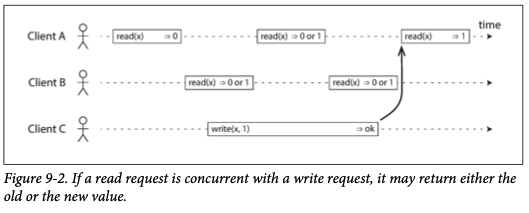
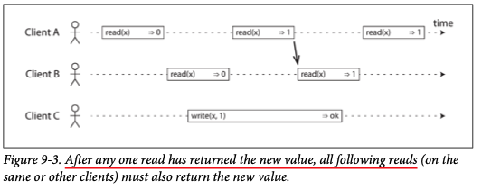
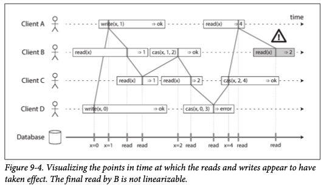

# Chapter 9. Consistency and Consensus

1. [Consistency Guarantees](#Consistency-Guarantees)
2. [Linearizability](#Linearizability)
    - [What Makes a System Linearizable?](#What-Makes-a-System-Linearizable?)
    - [Relying on Linearizabilty](#Relying-on-Linearizabilty)
    - [Implementing Linearizable Systems](#Implementing-Linearizable-Systems)
    - [The Cost of Linearizability](#The-Cost-of-Linearizability)
3. [Ordering Guarantees](#Ordering-Guarantees)
    - [Ordering and Causality](#Ordering-and-Causality)
    - [Sequence Number Ordering](#Sequence-Number-Ordering)

 

In chapter 8, the simplest way of handling faults is to simply entire service fail, and show user and error message.  
If that solution is unacceptable, we need to find ways of _tolerating_ faults(packet loss, reordered, duplicated, arbitrarily delayed, nodes pause, crash).  

One of the most important abstractions for distributed systems is _consensus_: getting all the nodes to agree on something.  
In this chapter, we will look into algorithms to solve consensus and related problems.  
Also, we will get an overview of what is and isn't possible and those fundamental limits.  

 

## Consistency Guarantees

Most replicated databases provide at least _eventual consistency_(also called as _convergence_):  
stop writing to the database and wait for some unspecified length of time, and eventually all read requests will return the same value.  
However, this is weak guarantee - it doesn't say anything about _when_ the replicas will converge.  

When working with a database that provides only weak guarantees, you need to be constantly aware of its limitations and bugs are subtle and hard to find by testing.  
In this chapter, we will explore stronger consistency models that data systems may choose to provide, but have worse performance or be less fault-tolerant that the systems with weawker guarantees.

 

## Linearizability

In an eventually consistent database, if you ask two different replicas the same question at the same time, you may get two different answers.  
Wouldn't it be a lot simpler if the database could give the illusion that there is only one replica?

This is the idea behind _linearizability(= atomic consistency, strong consistency, immediate consistency, external consistency)_:  
a system appear as if there were only one copy of the data.  
With this guarantee, even though there may be multiple replicas in reality, the application does not need to worry about them.  
In other words, linearizability is a _recency guarantee_.  

### What Makes a System Linearizable?

**Not fully linearlizable Example**

Any read operations that overlap in time with operation might return either 0 or 1.  
There operations are _concurrent_ with the write.  
However, this is not yet sufficient to fully describe linearizability:  
if reads that are concurrent with a write can return either the old or the new value.  

**Linearizable Example 1**

If one client's read returns the new value, all subsequent reads must also return the new value, even if the write operation has not yet completed.  

**Linearlizable Example 2**

#### Linearizability Versus Serializability

**Linearlizability**: 
recency guarantee on reads and writes of a register

**Serializability**:  
an isolation property of _transactions_, where every transaction may read and write multiple objects

A database may provide both serializability and linearlizability, and this combination is knows as _strict serializability_ or _strong one-copy serializability_.  
Implementations of serializability based on two-phase locking or actual serial execution are typically linearizable.  

However, serializable snapshot isolation is not linearizable;  
the whole point of a consistent snapshot is that it does not include writes that are most recent that the snapshot,  
and thus reads from the snapshot are not linearizable.  

### Relying on Linearizabilty

### Implementing Linearizable Systems

### The Cost of Linearizability

 

## Ordering Guarantees

### Ordering and Causality

### Sequence Number Ordering