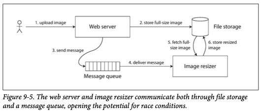

# Chapter 9. Consistency and Consensus

1. [Consistency Guarantees](#Consistency-Guarantees)
2. [Linearizability](#Linearizability)
    - [What Makes a System Linearizable?](#What-Makes-a-System-Linearizable?)
    - [Relying on Linearizabilty](#Relying-on-Linearizabilty)
    - [Implementing Linearizable Systems](#Implementing-Linearizable-Systems)
    - [The Cost of Linearizability](#The-Cost-of-Linearizability)
3. [Ordering Guarantees](#Ordering-Guarantees)
    - [Ordering and Causality](#Ordering-and-Causality)
    - [Sequence Number Ordering](#Sequence-Number-Ordering)
    - [Total Order Broadcast](#Total-Order-Broadcast)
4. [Distributed Transactions and Consensus](#Distributed-Transactions-and-Consensus)
    - [Atomic Commit and Two-Phase Commit (2PC)](#Atomic-Commit-and-Two-Phase-Commit-(2PC))
    - [Distributed Transactions in Practice](#Distributed-Transactions-in-Practice)
    - [Fault Tolerant Consensus](#Fault-Tolerant-Consensus)
    - [Membership and Coordination Services](#Membership-and-Coordination-Services)

 

The simplest way of handling faults is to simply entire service fail, and show user and error message.  
If that solution is unacceptable, we need to find ways of _tolerating_ faults(packet loss, reordered, duplicated, arbitrarily delayed, nodes pause, crash).  

One of the most important abstractions for distributed systems is _consensus_: getting all the nodes to agree on something.  
In this chapter, we will look into algorithms to solve consensus and related problems.  
Also, we will get an overview of what is and isn't possible and those fundamental limits.  

 

## Consistency Guarantees

Most replicated databases provide at least _eventual consistency_(also called as _convergence_):  
stop writing to the database and weaker wait for some unspecified length of time, and eventually all read requests will return the same value.  
However, this is weak guarantee - it doesn't say anything about _when_ the replicas will converge.  

When working with a database that provides only weak guarantees, you need to be constantly aware of its limitations and bugs are subtle and hard to find by testing.  
In this chapter, we will explore stronger consistency models that data systems may choose to provide, but have worse performance or be less fault-tolerant that the systems with weaker guarantees.

 

## Linearizability

In an eventually consistent database, if you ask two different replicas the same question at the same time, 
you may get two different answers.  
Wouldn't it be a lot simpler if the database could give the illusion that there is only one replica?

This is the idea behind _linearizability(= atomic consistency, strong consistency, immediate consistency, external consistency)_:  
a system appear as if there were only one copy of the data.  
With this guarantee, even though there may be multiple replicas in reality, the application does not need to worry about them.  
In other words, linearizability is a _recency guarantee_.  

### What Makes a System Linearizable?

**Not fully linearlizable Example**

Any read operations that overlap in time with operation might return either 0 or 1.  
There operations are _concurrent_ with the write.  
However, this is not yet sufficient to fully describe linearizability:  
if reads that are concurrent with a write can return either the old or the new value.  

**Linearizable Example 1**

If one client's read returns the new value, all subsequent reads must also return the new value, even if the write operation has not yet completed.  

**Linearlizable Example 2**

Client A has already read the new value 4 before B's read started, 
so B is not allowed to read an older value than A.  

#### Linearizability Versus Serializability

**Linearlizability**: 
recency guarantee on reads and writes of a register

**Serializability**:  
an isolation property of _transactions_, where every transaction may read and write multiple objects

A database may provide both serializability and linearlizability, and this combination is knows as _strict serializability_ 
or _strong one-copy serializability_.  
Implementations of serializability based on two-phase locking or actual serial execution are typically linearizable.  

However, serializable snapshot isolation is not linearizable;  
the whole point of a consistent snapshot is that it does not include writes that are most recent that the snapshot,  
and thus reads from the snapshot are not linearizable.  

### Relying on Linearizabilty

There is a few areas in which linearizability is an important requirement for making a system work correctly.  

#### Locking and leader election

A system that uses single-leader replication needs to ensure that there is indeed only one leader, not several(split brain).  
Apache ZooKeeper, etcd are often used to implement distributed locks and leader election.  
A linearizable storage service is the basic foundation for these coordination tasks(they use details using libraries like Apache Curator).  
Also, Oracle Real Application Clusters(RAC) uses a lock per disk page, with multiple nodes sharing access to the same disk storage system.

#### Constraints and uniqueness guarantees

If you want to enforce constraints and uniqueness guarantees as the data is written, you need linearizabilty.  
For example, a username or email address must uniquely identify one user, bank account balance never goes negative.  
These constraints all require there to be a single up-to-date value.  

In real applications, it is sometimes acceptable to treat such constraints loosely.  

#### Cross-channel timing dependencies

The linearizabiltiy violation was only noticed because there was an additional communication channel in the system.  

There is a risk of a race condition:  
the message queue might be faster than the internal replication inside the storage service.  
When the resizer fetches the image, it might see an old version of the image.  

This problem arises because there are **two different communication channels** 
between the web server and the resizer: the file storage and message queue.

### Implementing Linearizable Systems

The most common approach to making a system fault-tolerant is to use replication.  
Let's check replication methods, and compare whether they can be made linearizable:  

- _Single-leader replication (potentially linearizable)_
  - If you make reads from the leader or from synchronously updated followers, they have the _potential_ to be linearizable.  
  - However, not every single-leader database is actually linearizable, either by design or due to concurrency bugs.
  - Also, you have to know for sure **who the leader is**.
  - With asynchronous replication, failover may even lose committed writes, which violates both durability and linearizability.  
- _Consensus algorithms (linearizable)_
  - They can bear a resemblance to single-leader replication with measures to prevent split brain and stale replicas.
  - Zookeeper, etcd
- _Multi-leader replication (not linearizable)_
  - They concurrently process writes on multiple nodes and asynchronously replicate them to other nodes.
  - Therefore, they can produce conflicting writes.  
- _Leaderless replication (probably not linearizable)_  
  - They depend on how you define strong consistency. However, it is not quite true.
  - Conflict resolution based on time-of-day clocks in Cassandra, are nonlinearizable, because clock timestamps cannot be guaranteed.
  - Sloppy quorums also ruin any chance of linearizability.

#### Linearizability and quorums

It seems as though strict quorum reads and writes should be linearizable.  
However, when we have variable network delays, it is possible to have race conditions.  

Interestingly, it is possible to make Dynamo-style quorums linearizable at the cost of reduced performance;  
a reader must perform read repair, and a writer must read the latest state of a quorum of nodes before sending its writes.  

However, Riak does not perform synchronous read repair due to the performance penalty.  
Cassandra does wait for read repair to complete on quorum reads, 
but it loses linearizability if there are multiple concurrent writes to the same key, 
due to its use of last-write-wins conflict resolution.

Therefore, it is safest to assume that a leaderless system with Dynamo-style replication does not provide linearizability.  

### The Cost of Linearizability

Let's consider what happens if there is a network interruption between the two datacenters.  
With a multi-leader database, each datacenter can continue operating normally,  
but if a single-leader replication is used, the leader must be in one of the datacenters.  

If the application requires linearizable reads and writes, 
the network interruption causes the application to become unavailable in the datacenters that cannot contact the leader.  

#### The CAP theorem

Any linearizable database has this problem, no matter how it is implemented.  
The issue also isn't specific to multi-datacenter deployments, but can occur on any unreliable network, even within one datacenter.  
The trade-off is as follows:

- If your application _requires_ linearizability, they must wait until the network problem is fixed, or return an error.  
- If your application _does not require_ linearizability, the application can remain _available_ in the face of a network problem, but its behavior is not linearizable.  

Thus, applications that don't require linearizability can be more tolerant of network problems.  
This insight is popular known as the _CAP theorem_.  

At the time, CAP encouraged database engineers to explore a wider design space of distributed shared-nothing systems, 
which is suitable for implementing large-scale web services.  
CAP deserves credit for this culture shift-witness the explosion of new database technologies since the mid-2000s(known as NoSQL).  

The CAP theorem as formally defined is of very narrow scope: consistency model(linearizability), kind of fault(network partitions).  
Thus, although CAP has been historically influential, it has little value for designing systems.  

#### Linearizability and network delays

Although linearizability is a useful guarantee, few systems are actually linearizable in practice.  
Even RAM on a modern multi-core CPU is not linearizable.  
If a thread running on one CPU core writes to a memory address, and a thread on another CPU core reads the same address shortly afterward, 
it is not guaranteed to read the value written by the first thread(unless a _memory barrier_ or _fence_ is used).  

The reason for dropping linearizability is _performance_, not fault tolerance.  
Many distributed databases do so primarily to increase performance, not so much for fault tolerance.  
A faster algorithm for linearizability does not exist, but weaker consistency models can be much faster, 
so this trade-off is important for latency-sensitive systems.   

 

## Ordering Guarantees

### Ordering and Causality

There are several reasons why ordering keeps coming up, and one of the reasons is that it helps preserve _causality_.  
Causality imposes an ordering on events: cause some before effect; a message is sent before that message is received; 
the question comes before the answer.  
If a system obeys the ordering imposed by causality, we say that it is _causally consistent_.  

#### The causal order is not a total order

_total order_: allows any two elements to be compared  
  - _Linearizability_: every operation is atomic
_partially ordered_: in some cases one set is greater than another, but in other cases they are incomparable.  
  - _Causality_: two events are ordered if they are causally related, but they are incomparable if they are concurrent.  

Therefore, according to this definition, there are no concurrent operations in a linearizable datastore:  
there must be a single timeline along which all operations are totally ordered.  

#### Linearizability is stronger that causal consistency

The linearizability _implies_ causality: any system that is linearizable will preserve causality correctly.  
Making a system linearizable can harm its performance and availability, 
so some distributed data systems abandoned linearizability to achieve better performance.  

The good news is that a middle ground is possible.  
In many cases, systems that appear to require linearizability in fact only really require causal consistency, 
which can be implemented more efficiently.

#### Capturing causal dependencies

In order to maintain causality, you need to know which operation _happened before_ which other operation.  
In order to determine causal dependencies, we need some way of describing the "knowledge" of a node in the system(similar to detecting concurrent writes).  
In order to determine causal ordering, the databases needs to know which version of the data was read by the application.  

### Sequence Number Ordering

In many applications, clients read lots of data before writing something.  
Explicitly tracking all the data would mean a large overhead.  

There is a better way: we can use _sequence numbers_ or _timestamps_ to other events.  
In this case, we do not use problematic a time-of-day clock, we use _a logical clock_ instead.  

Such sequence numbers or timestamps are compact, and they provide a _total order_.  
With a single-leader replication, the replication log defines a total order of write operations that is consistent with causality.

#### Noncausal sequence number generators

If there is not a single leader, it is less clear how to generate sequence numbers for operations.
There are some methods in practice, 
and all perform better and are more scalable than pushing all operations through a single leader that increments a counter.  
However, they all have problem: the sequence numbers they generate are _not consistent with causality_.  

There are various methods in practice and problems:  

1. Each node can generate its own independent set of sequence numbers. (for two nodes, one uses odd number and the other uses even number)
  - problem: cannot accurately tell which one causally happened first
2. You can attach timestamp from a time-of-day clock to each operation.  
  - problem: clock skew
3. You can preallocate blocks of sequence numbers(one for 1~1000, another for 1001~2000).
  - problem: the sequence number is inconsistent with causality  

#### Lamport timestamps

There is a simple method for generating sequence numbers that is consistent with causality: _Lamport timestamp_

Every node and every client keeps track of the _maximum_ counter value it has seen so far, 
and includes that maximum on every request.  

Lamport timestamps are sometimes confused with version vectors.  

- version vectors: distinguish whether two operations are concurrent or whether one is causally dependent on the other
- Lamport timestamps: enforce a total ordering

#### Timestamp ordering is not sufficient

Although Lamport timestamps define a total order of operations, they are not sufficient to solve many common problems in distributed systems.  
You can compare the timestamps to determine the winner, 
but it is not sufficient when a node has just received a request, and need to decide _right_ now whether the request should succeed or fail.  
The node does not know whether another node is concurrently in the process of same operation, and what timestamp that other node may assign to the operation.  
You would have to check with every other node to see what it is doing.  

The problem here is that the total order of operations only emerges after you have collected all of the operations.  
To conclude: in order to implement something like a uniqueness constraints for usernames, 
it's not sufficient to have a total ordering of operations - you also need to know when that order si finalized.  

### Total Order Broadcast

The challenge is how to scale the system if the throughput is greater than a single leader can handle, 
and also how to handle failover if the leader fails.  
This problem is known as _total order broadcast_ or _atomic broadcast_.

Total order broadcast is usually described as a protocol for exchanging messages between nodes.  

- _Reliable delivery_- No messages are lost: if a message is delivered to one node, it is delivered to all nodes. 
- _Totally ordered delivery_- Messages are delivered to every node in the same order.   

#### Using total order broadcast

1. Consensus services such as ZooKeeper and etcd actually implement total order broadcast.  
2. Total order broadcast is exactly what you need for database replication(_state machine replication_).  
3. Total order broadcast can be used to implement serializable transactions.
4. Useful for implementing a lock service that provides fencing tokens. 

In total order broadcast, the order is fixed at the time the messages are delivered:  
a node is not allowed to retroactively insert a message into an earlier position in the order 
if subsequent messages have already been delivered.  
**This fact makes total order broadcast stronger that timestamp ordering.**

#### Implementing linearizable storage using total order broadcast

Skip..

#### Implementing total order broadcast using linearizable storage

Skip.. 

 

## Distributed Transactions and Consensus

Consensus is one of the important and fundamental problems in distributed computing.  
The goal is simply to _get serveral nodes to agree on something_.  
Unfortunately, many broken systems have been built in the mistaken belief that this problem is easy to solve.  

There are a number of situations in which it is important for nodes to agree.  

- _Leader election_
- _Atomic commit_

#### The Impossibility of Consensus

FLP: there is no algorithm that is always ables to reach consensus if there is a risk that a node may crash.  
In a distributed system, we must assume that nodes may crash, so reliable consensus is impossible.  

If the algorithm is allowed to use timeouts, or some other way of identifying suspected crashed nodes, 
then consensus becomes solvable.  
Thus, although the FLP result about the impossibility of consensus is of great theoretical importance, 
distributed systems can usually achieve consensus in practice.  

### Atomic Commit and Two Phase Commit (2PC)

Atomicity prevents failed transactions from littering the database with half-finished results and half-updated state.  
This is especially important for multi-object transactions and databases that maintain secondary indexes.  
Atomicity ensures that the secondary index stays consistent with the primary data.  

#### From single-node to distributed atomic commit

On a single node, transaction commitment crucially depends on the _order_ in which data is durably written to disk.  
The key deciding moment is when the disk finishes writing the commit record.  
Thus, it is a single device that makes the commit atomic.  

However, what if multiple nodes are involved in a transaction?  
It is not sufficient to simply send a commit request to all of the nodes and independently commit the transaction on each one.  
In doing so, it could easily happen that the commit succeeds on some nodes and fails on other nodes(violation/conflict, lost, crash).  
If some nodes commit the transaction but others abort it, the nodes become inconsistent with each other.

#### Introduction to two-phase commit

Two-phase commit is an algorithm for achieving atomic transaction commit across multiple nodes 
to ensure that either all nodes commit or all nodes abort.  
2PC is used internally in some databases and also made available to applications in the form of _XA transactions_.  

2PC uses a new component: a _coordinator_ (also known as _transaction manager_).  
We call database nodes _participants_.  

- Phase 1. Coordinator sends a _prepare_ request to each of the nodes
- Phase 2. Coordinator tracks the responses from the participants 
    - if all participants reply "yes", the coordinator sends out a _commit_ request
    - if any participants replies "no", the coordinator sends an _abort_ request

#### A system of promises

Why two-phase commit ensures atomicity, while one-phase commit across several nodes does not? What makes 2PC different?

The protocol contains two crucial "points of no return":  
when a participant votes "yes," it promises that it will definitely be able to commit later;  
and once the coordinator decides, that decision is irrevocable.  

#### Coordinator of failure

If any of the prepare requests fail or time out, the coordinator aborts the transaction;  
if any of the commit or abort requests fail, the coordinator retries them indefinitely.  
However, what happens if the coordinator crashes?

Once the participant has received a prepare request and voted "yes", 
it can no longer abort unilaterally - it must wait to hear back from the coordinator whether the transaction was committed or aborted.  
If the coordinator crashes or the network fails at this point, the participant can do nothing but wait(_in doubt_ or _uncertain_ state).  

Without hearing from the coordinator, the participant has no way of knowing whether to commit or abort.  
The only way 2PC can complete is by waiting for the coordinator to recover.  
Thus, the commit point of 2PC comes down to a regular single-node atomic commit on the coordinator.  

#### Three-phase commit

Two-phase commit is called a _blocking_ atomic commit protocol because of the stuck waiting for the coordinator to recover.  
In theory, it is possible to make an atomic commit protocol _nonblocking_, but this work in practice is not so straightforward.  

As an alternative to 2PC, an algorithm called _three-phase commit_(3PC) has been proposed.  
However, in general, nonblocking atomic commit requires a _perfect failure detector_ which costs time.  
For this reason, 2PC continues to be used, despite the known problem with coordinator failure.  

### Distributed Transactions in Practice

Two-phase commit have a mixed reputation:  

- pros: providing an important safety guarantee
- cons: causing operational problems, killing performance, promising more that they can deliver

Many cloud services choose not to implement distributed transactions due to the operational problems they engender.  
Much of the performance cost inherent in two-phase commit is due to the additional disk forcing(fsync) 
that is required for crash recovery, and the additional network round-trips.  

Two types of distributed transactions:  

- _Database-internal distributed transactions_
  - support internal transactions among the nodes of that database
  - ex. VoldDB, MySQL Cluster's NDB stroage engine
- _Heterogeneous distributed transactions_
  - two databases from different vendors
    
Database-internal distributed transactions do not have to be compatible with any other system, so it can often work well.  
On the other hand, transactions spanning heterogeneous technologies are a lot more challenging.  

#### Exactly-once message processing

Heterogeneous distributed transactions allow diverse systems to be integrated in powerful ways.  
For example, a message from a message queue can be acknowledged as processed 
if and only if the database transaction for processing the message was successfully committed. 
This is implemented by atomically committing the message acknowledgment, and the database writes in a single transaction.  

By atomically committing the message and the side effects of its processing, 
we can ensure that the message is _effectively_ processed exactly once, even if it required a few retries before it succeeded.  

#### XA transactions

XA was introduced in 1991 and has been widely implemented:  
traditional relational databases(PostgreSQL, MySQL, DB2, SQL Server, and Oracle) and message brokers(ActiveMQ, HornetQ, IBM MQ).  

XA is not a network protocol - merely a C API for interfacing with a transaction coordinator.  
If the driver supports XA, that means it calls the XA API to find out 
whether an operation should be part of a distributed transaction - and if so, it sends the necessary information to the database server.   
The driver also exposes callbacks through which the coordinator can ask the participant to prepare, commit, or abort.

#### Holding locks while in doubt

Database transactions usually take a row-level exclusive lock on any rows they modify, to prevent dirty writes.  
In addition, if you want serializable isolation, a database using two-phase locking would also have to take a 
shared lock on any rows _read_ by the transaction.  

Other transactions cannot simply continue with their business.  
This can cause large parts of your application to become unavailable until in-doubt transaction is resolved.  

#### Recovering from coordinator failure

In practice, _orphaned_ in-doubt transactions do occur - that is, 
transactions for which the coordinator cannot decide the outcome for whatever reason.  
These transactions cannot be resolved automatically, so they sit forever in the database, 
holding locks and blocking other transactions.  

The only way out is for an administrator to manually decide whether to commit or roll back the transactions.  
Many XA implementations have an emergency escape hatch called _heuristic decisions_: 
allowing a participant to unilaterally decide to abort or commit an in-doubt transaction 
without a definitive decision from the coordinator.  

#### Limitations of distributed transactions

XA transactions solve the real and important problem of keeping several participant data systems consistent with each other.  
However, they also introduce major operational problems:  
transaction coordinator is itself a kind of database, so it needs to be approached with the same care as any other important database:  

- Many coordinator implementations are not highly available by default, and have only rudimentary replication support.  
- Many server-side applications are developed in a stateless model, but with coordinator, servers are no longer stateless.  
- Since XA needs to be compatible with a wide range of data systems, it is necessarily a lowest common denominator.  
- If _any_ part of the system is broken, the transaction also fails.

### Fault Tolerant Consensus

The consensus problem is normally formalized as follows:  
one of more nodes may _propose_ values, and the consensus algorithm _decides_ on one of those values.  
In this formalism, a consensus algorithm must satisfy the following properties:  

- _Uniform agreement_: No two nodes decide differently
  - define the core idea of consensus
- _Integrity_: No node decides twice
  - define the core idea of consensus
- _Validity_: If a node decides value v, then v was proposed by some node
  - rule out trivial solutions
- _Termination_: Every node that does not crash eventually decides some value. 
  - fault tolerance, it must make progress

#### Consensus algorithms and total order broadcast

The best-known fault-tolerant consensus algorithms are Viewstamped Replication(VSR).  
They decide on a _sequence_ of values, which makes them _total order broadcast_ algorithms.  

Remember that total order broadcast requires messages to be delivered exactly once, in the same order, to all nodes.  
So, total order broadcast is equivalent to repeated rounds of consensus.  

Viewstamped Replication, Raft, and Zab implement total order broadcast directly, 
because that is more efficient than doing repeated rounds of one-value-at-a-time consensus.  

#### Single-leader replication and consensus

Skip.. nothing to write

#### Epoch numbering and quorums

All of the consensus protocols discussed so far internally use a leader in some form or another, 
but the don't guarantee that the leader is unique.  
Instead, they can make a weaker guarantee: _epoch number_.  
Within each epoch, the leader is unique.  

Before a leader is allowed to decide anything, it must collect votes from a _quorum_ of nodes.  
For every decision that a leader wants to make, it must send the proposed value to the other nodes 
and wait for a quorum of nodes to response in favor of the proposal.  
Thus, we have two rounds of voting: choose a leader + vote on a leader's proposal
If the vote on a proposal does not reveal any higher-numbered epoch, 
the current leader can conclude that no leader election with a higher epoch number has happened, 
and therefore be sure that it still holds the leadership.  

This voting process looks similar to two-phase commit.  
However, there are differences which are key to the correctness and fault tolerance of a consensus algorithm.  

- only require votes from a majority of nodes, not _every_ participant
- consensus algorithm define a recovery process

#### Limitations of consensus

However, consensus algorithms are not used everywhere, because the benefits come at cost.  

- looks like synchronous replication
- strict majority to operate
- they can't just add or remove nodes in the cluster(_Dynamic membership_)
- terrible performance

### Membership and Coordination Services

#### Allocating work to nodes

#### Service discovery

#### Membership services

