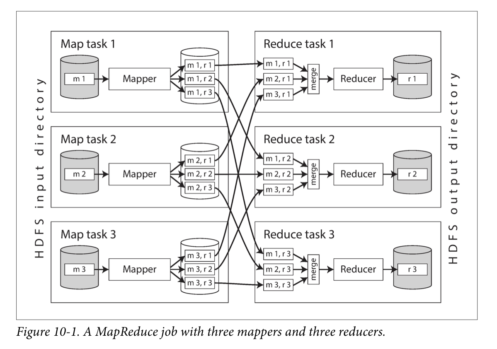
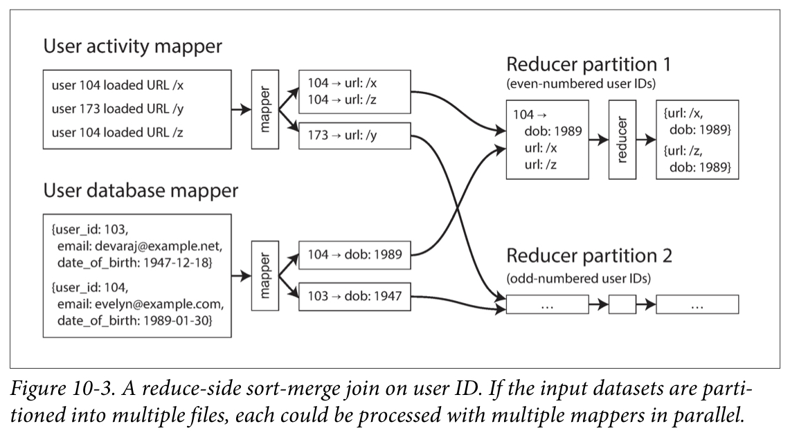

# Chapter 9. Batch Processing

1. [Batch Processing with Unix Tools](#Batch-Processing-with-Unix-Tools)
    - [Simple Log Analysis](#Simple-Log-Analysis)
    - [The Unix Philosophy](#The-Unix-Philosophy)
2. [MapReduce and Distributed Filesystems](#MapReduce-and-Distributed-Filesystems)
    - [MapReduce Job Execution](#MapReduce-Job-Execution)
    - [Reduce Side Joins and Grouping](#Reduce-Side-Joins-and-Grouping)
    - [Map Side Joins](#Map-Side-Joins)
    - [The Output of Batch Workflows](#The-Output-of-Batch-Workflows)
    - [Comparing Hadoop to Distributed Databases](#Comparing-Hadoop-to-Distributed-Databases)
3. [Beyond MapReduce](#Beyond-MapReduce)
    - [Materialization of Intermediate State](#Materialization-of-Intermediate-State)
    - [Graphs and Iterative Processing](#Graphs-and-Iterative-Processing)
    - [High Level APIs and Languages](#High-Level-APIs-and-Languages)

<br/>

Three different type fo systems

1. _Services (online systems)_
   - primary measure of performance : **response time**
   - availability is often very important
2. _Batch processing systems (offline systems)_
   - primary measure of performance : **throughput**
   - takes a large amount of input data, runs a _job_ to process it, and produces some output data
3. _Stream processing systems (near-real-time systems)_
   - _near-real-time_ or _nearline_ processing
   - operates on events shortly after they happen -> lower latency

Batch processing is an important building block in our quest to build reliable, scalable, and maintainable applications. 
In this chapter, we will look at MapReduce and several other batch processing algorithms and frameworks, 
and explore how they are used in modern data systems.  

<br/>

## Batch Processing with Unix Tools

### Simple Log Analysis

```script
cat /var/log/nginx/access.log |
   awk '{print $7}'
   sort
   uniq -c
   sort -r -n
   head -n 5
```

Those command line is incredibly powerful.  
It will process gigabytes of log files in a matter of seconds, 
and you can easily modify the analysis to suit your needs.  

#### Chain of commands versus custom program

Custom program programmed with hash table is not as concise as the chain of Unix pipes, 
but it's fairly readable, and which of the two you prefer is partly a matter of taste.

There is a big difference in the execution flow, 
which becomes apparent if you run this analysis on a large file.  

#### Sorting versus in-memory aggregation

If the _working set_ of the job(amount of memory to which the job needs random access) is small enough, 
an in-memory hash table works fine.  

On the other hand, if the job's working set is larger than the available memory, 
the sorting approach has the advantage that it can make efficient use of disks.  

It's the same principle in "SSTables and LSM-Trees":  
chunks of data can be sorted in memory and written out to disk as segment files, 
and then multiple sorted segments can be merged into a larger sorted file.  

The `sort` utility in GNU Coreutils automatically handles larger-than-memory datasets by spilling to disk, 
and automatically parallelize sorting across multiple CPU cores.  
Therefore, the simple chain of Unix commands we saw earlier easily scales to large datasets, without running out of memory.  

### The Unix Philosophy

The idea of connecting programs with pipes became part of what is now knows as the _Unix philosophy_.  
A set of design principles:  

1. Make each program do one thing well.
2. Expect the output of every program to become the input to another. 
3. Don't hesitate to throw away the clumsy parts and rebuild them. 
4. Use tools in preference to unskilled help to lighten a programming task. 
-> automation, rapid prototyping, incremental iteration, breaking down large projects into manageable chunks

A Unix shell like `bash` lets us easily _compose_ these small programs into surprisingly powerful data processing jobs.  

#### A uniform interface

If you expect the output of one program to become the input to another program, 
that means those programs must use the same data format - _compatible interface_.  

By convention, many(but not all) Unix programs treat this sequence of bytes as ASCII text.  
Although it's not perfect, even decades later, the uniform interface of Unix is still something remarkable.  

#### Separation of logic and writing

A program can still read and write files directly if it needs to, 
but the Unix approach works best if a program doesn't worry about particular file paths and simply uses `stdin` and `stdout`. 
This allows a shell user to wire up the input and output in whatever way they want; 
The program doesn't know or care where the input is coming from and where the output is going to - _loose coupling_, _late binding_, _inversion of control_.

#### Transparency and experimentation

Part of what makes Unix tools so successful is that they make it easy to see what is going on:

- The input files to Unix commands are normally treated as immutable. 
  You can run the commands as often as you want, trying various command-line options, without damaging the input files. 
- You can end the pipeline at any point, pipe the output into `less`, and look at it to see if is has expected form. 
  This ability to inspect is great fo debugging. 
- You can write the output of one pipeline stage to a file and use that file as input to the next stage. 
  This allows you to restart the later stage without rerunning the entire pipeline.  

<br/>

## MapReduce and Distributed Filesystems

As with most Unix tools, running a MapReduce job normally does not modify the input and does not have any side effects other than producing the output. 
The output files are written once, sequentially.

Like `stdin` and `stdout` from Unix, MapReduce jobs read and write files on a distributed filesystem.  
In Hadoop's implementation of MapReduce, this filesystem is called HDFS(Hadoop Distributed File System).  
+ GlusterFS, Quantcast File System(QFS), Amazon S3, Azure Blob Storage, OpenStack Swift

HDFS is based on the _shared-nothing_ principle.  
The shared-nothing approach requires no special hardware, only computers connected by a conventional 

HDFS consists of a daemon process running on each machine, 
exposing a network service that allows other nodes to access files stored on that machine.  
A central server called the _NameNode_ keeps tracks of which file blocks are stored on which machine.  
Thus, HDFS conceptually creates one big filesystem that can use the space on the disks of all machines running the daemon.

### MapReduce Job Execution

The pattern of data processing in MapReduce is very similar to Unix system:

1. Read a set of input files, and break it up into _records_. 
2. Call the mapper function to extract a key and value from each input record. 
3. Sort all the key-value pairs by key. 
4. Call the reducer function to iterate over the sorted key-value pairs. 

to create a MapReduce job, you need to implement two call back function, the mapper and reducer: 

_Mapper_
- called once for every input record
- extract the key and value from the input record
- each record is handled independently

_Reducer_
- collects all the values belonging to the same key
- calls the reducer with an iterator over the collection of values
- reducer can produce output records

#### Distributed execution of MapReduce

MapReduce can parallelize a computation across many machines, without you having to write code to explicitly handle the parallelism.  
The mapper and reducer only operate on one record at a time and don't need to know where their input is coming, or their output is going to, 
the framework can handle the complexities of moving data between machines.  
We can use Unix tools as mappers and reducers, but more commonly they are implemented as functions in a conventional programming language(Hadoop-Java, MongoDB, CouchDB-JavaScript).

In Hadoop MapReduce job, parallelization is based on partitioning.  
It uses _putting the computation near the data_ principle:  
it saves copying the input file over the network, reducing network load and increasing locality.  



The process of partitioning by reducer, sorting, and copying data partitions from mappers to reducers is known as the _Shuffle_.  
Sorting key-value pairs is performed in stages. 

1. each map task partitions its output by reducer, based on the hash of the key
2. each of these partitions written to a sorted file on the mapper's local disk, using a technique similar to "SSTables and LSM Trees"
3. whenever a mapper finishes reading its input file and writing its sorted output files, 
   the MapReduce scheduler notifies the reducers that they can start fetching the output files from that mapper
4. the reducer connect to each of the mappers and download the files of sorted key-value pairs for their partition

#### MapReduce workflows

The range of problems you can solve with a single MapReduce job is limited.  
Thus, it is very common for MapReduce jobs to be chained together into _workflows_ 
such that the output of one job becomes the input to the next job.  

A batch job's output is only considered valid when the job has completed successfully.  
To handle these dependencies between job executions, various workflow schedulers for Hadoop have been developed, including Oozie, Azkaban, Luigi, Airflow, and Pinball.
These schedulers also have management features that are useful when maintaining a large collection of batch jobs.

### Reduce Side Joins and Grouping

In many datasets it is common for one record to have an association with another record: _foreign key, document reference_  
A join in necessary whenever you have some code that needs to access records on both sides of that association.  

In database, the database will typically use an _index_ to quickly locate the records of interest.  
However, MapReduce has no concept of indexes- at least not in usual sense.  

When a MapReduce job is given a set of files as input, it reads the entire content of all of those files.  
In analytic queries, it is common to want to calculate aggregates over many records, so it might be quite a reasonable thing to do.
Expecially, if you can parallelize the processing across multiple machines.  

#### Example: analysis of user activity events

The simplest implementation for join is to go over the data and query the database with id.  
This is possible, but is would suffer from very poor performance.  

In order to achieve good throughput in a batch process, the computation must be local to one machine.  
Moreover, querying a remote database would mean that the batch job becomes nondeterministic, because the data in the remote database might change.  

Thus, a better approach would be to take a copy of the database and to put it in the same distributed filesystem.  
You would have two set of files in HDFS, and could use MapReduce to bring together all the relevant records in the same place and process them efficiently.  

#### Sort-merge joins



When the MapReduce framework partitions the mapper output by key and then sorts the key-value pairs, 
the effect is that all the activity events and the user record with the same user ID become adjacent to each other in the reducer input.  
The MapReduce job can even arrange the records to be sorted such that the reducer always sees the record from the user database first, 
followed by the activity events in timestamp order - this technique is knows as a _secondary sort_.  

Since the reducer processes all of the records fora  particular user ID in one go, 
it only needs to keep one user record in memory at any one time.  
This algorithm is knows as a _sort-merge join_.  

#### Bringing related data together in the same place

In a sort-merge join, the mappers and the sorting process make sure that all the necessary data to perform the join operation for a particular user ID 
is brought together in the same place; a single call to the reducer.  
Having lined up all the required data in advance, single-threaded piece of code that can churn through records with high throughput and low memory oeverhead.  

Mappers "send messages" to the reducers.  
When a mapper emits a key-value pair, the key acts like the destination address.  
Thus, all key-value pairs with the same key will be delivered to the same destination.  

MapReduce's separation from network communication and application logic contrasts with the typical use of databases.  
Since MApReduce handles all network communication, it also shields the applciation code form havig to worry about partial failures.  

#### GROUP BY

The simplest way of implementing such a grouping operation with MapReduce
is to set up the mappers so that the key-value pairs they produce use the desired grouping key.  

Another common use for grouping is collating all the activity events for a particular user session, 
in order to find out the sequence of a actions that the user took - a process called _sessionization_.  

If you have multiple web servers handling user requests, 
the activity events  for a particular user are most likely scattered across various different servers' log files.  
You can implement sessionization by using a session cookie, user ID, or similar identifier as the grouping key 
and bringing all the activity events for a particular user together in one place.  

#### Handling skew

The pattern of "bringing all records with the same key to the same place" breaks down if there is a large amount of data related to a single key - _linchpin_ or _hot keys_".  
Collecting all activity related to a celebrity in a single reducer can lead to significant _skew_ (also knows as _hot keys_) - 
that is, reducer must process significantly more records than the others.  

For this issue, _skew join_ method in Pig runs a sampling job to determine which keys are hot.  
For the other input to the join, records relating to the hot key need to be replicated to all reducers handling that key.  
Secondly, _shared join_ method in crunch requires the hot keys to be specified to explicitly rather than using a sampling job.  

Hive's skewed join requires hot keys to be specified explicitly in the table metadata, 
and it stores records related to those keys in separate files from the rest.  
When performing a join on that table, it uses a map-side join for the hot keys.  

Two stages for grouping records by hoe key and aggregating them:  
1. MapReduce stage: send records to a random reducer, so that each reducer performs the grouping on a subset of records and outputs a more compact aggregated value per key.  
2. MapReduce job: combines the values from all of the first-stage reducers into a single value per key.  

### Map Side Joins

_reduce-side joins_
   - pros: you do not need to make any assumptions about the input data
   - cons: compying to reducers, and merging of reducer inputs can be quite expensive.  

_map-side join_
   - can apply when you can make certain assumptions about your input data -> can make joining faster
   - no reducers and no sorting
   - mapper simply reads one input file block and writes one output file to the filesystem

#### Broadcast hash joins

Map-side join can be applied to the case where a large dataset is joined with a small dataset.  
The small dataset needs to be small enough that it can be loaded entirely into memory in each of the mappers.  

It first read the database from the distributed filesystem into an in-memory hash table.  
The mapper can scan over the user activity and simply look up the user ID for each event in hash table.  

_broadcast hash join_
   - each mapper for a partition of the large input reads the entirety of the small input
   - it uses hash table
   - supported by Pic, Hive, Cascading, Crunch

Instead of using in-memory hash table, 
an alternative is to store the small join input in a read-only index on the local disk.  
Frequently used parts will remain in the operating system's page cache, 
so this approach can provide random-access lookups almost as fast as in-memory hash table, 
but without actually requiring the dataset to fit in memory.  

#### Partitioned hash joins

If the inputs to the map-side join are partitioned, hash join approach can be applied to each partition independently.  
f there are same numbered partition, it is sufficient for each mapper to oonly read one partition from each of input datasets.  
This approach only works if both of the join's input have the same number of partitions.  

known as _bucketed map joins_ in Hive

#### Map-side merge joins

If datasets are partitioned and also _sorted_ based on the key, 
a mapper can perform the same merging operation that would normally be done by a reducer.  
However, it may still be appropriate to perform the merge join in a separate map-only job.  

#### MapReduce workflows with map-side joins

As discussed, map-side joins also make more assumptions about the size, sorting, and partitioning of their input datasets.  
Knowing about the physical layout of datasets in the distributed filesystem becomes important when optimizing join strategies.

### The Output of Batch Workflows

What is the result of all of that processing, once it is done?
Why are we running all these jobs in the first place?

A workflow of MapReduce jobs is not the same as a SQL query used for analytic purposes.  
The output of a batch process is often not a report, but some other kind of structure.

#### Building search indexes

Google’s original use of MapReduce was to build indexes for its search engine.  
Today, Hadoop MapReduce remains a good way of building indexes for Lucene/Solr.

If you need to perform a full-text search over a fixed set of documents, 
then a batch process is a very effective way of building the indexes: 
the mappers partition the set of documents as needed, 
each reducer builds the index for its partition, and the index files are written to the distributed filesystem

- pros: indexing process is very easy
- cons: if the indexed set of documents changes, it has to rerun, so it's expensive

#### Key-value stores as batch process output

Another common use for batch processing is to build machine learning systems such as classifiers.  
How does the output from the batch process get back into a database where the web application can query it?

The most obvious choice might be to use the client library for your favorite database directly within a mapper or reducer, 
and to write from the batch job directly to the database server, one record at a time.  
However, it is a bad idea for following reasons: 

- performance is poor
- database cas easily be overwhelmed, and its performance for queries is likely to suffer
- if the entire job fails, no output is produced

A much better solution is to build a brand-new database inside the batch job and write it as files to the job’s output directory in the distributed filesystem, just like the search indexes.  
When loading data into Voldemort, the server continues serving requests to the old data files 
while the new data files are copied from the distributed filesystem to the server’s local disk.  
Once the copying is complete, the server atomically switches over to querying the new files.  
If anything goes wrong in this process, it can easily switch back to the old files again, since they are still there and immutable.  

#### Philosophy of batch process outputs

Like Unix philosophy by treating inputs as immutable and avoiding side effects, 
batch jobs not only achieve good performance but also become much easier to maintain:  

- ease of rolling back
- feature development can proceed more quickly (_minimizing irreversibiliy_)
- fault tolerance
- same set of files can beused as input for various different jobs
- a separation of concerns and enables potential reuse of code

### Comparing Hadoop to Distributed Databases

Hadoop is somewhat like a distributed version of Unix, 
where HDFS is the filesystem and MapReduce is a quirky implementation of a Unix process.  

The biggest difference is that MPP databases focus on parallel execution of analytic SQL queries on a cluster of machines, 
while the combination of MapReduce and a distributed filesystem provides something much more like a general-purpose operating system.

#### Diversity of storage


**MPP(Massively parallel processing)** 
 
- require careful up-front modeling of the data and query patterns
  before importing the data into the database’s proprietary storage format.
- careful schema design slows down that centralized data collection
- indiscriminate data dumping shifts the burden of interpreting the data

**Hadoop**

- opened up the possibility of indiscriminately dumping data into HDFS
- simply making data available quickly (_sushi principle_)

#### Diversity of processing models

**MPP(Massively parallel processing)**

- monolithic, tightly integrated pieces of software that take care of storage layout on disk, query planning, scheduling, and execution
- can achieve very good performance on the types of queries for which it is designed

**MapReduce**  

- gave engineers the ability to easily run their own code over large datasets
- too limiting and performed too badly for some types of processing

**Hadoop**

- allows expressive queries and elegant semantics without the need to write code
- it was feasible to implement a whole range of approaches, which would not have been possible within the confines of a monolithic MPP database
- system is flexible enough to support a diverse set of workloads within the same cluster.
- includes both random-access OLTP databases

#### Designing for frequent faults

When comparing MapReduce to MPP databases, two more differences in design approach stand out:  
the handling of faults and the use of memory and disk.

**MPP(Massively parallel processing)**

- If a node crashes while a query is executing, it aborts the entire query
- prefer to keep as much data as possible in memory

**MapReduce**

- can tolerate the failure of a map or reduce task without it affecting the job as a whole by retrying work at the granularity of an individual task
- eager to write data to disk
- more appropriate for larger jobs

experiment -> p.418

## Beyond MapReduce

Implementing a complex processing job using the raw MapReduce APIs is actually quite hard and laborious.  
In response to the difficulty of using MapReduce directly, various higher-level programming models were created.  

However, there are also problems with MapReduce which are not fixed by adding another level of abstraction and which manifest themselves as poor performance for some kides of processing.  
On the one hand, MapReduce is robust.  
On the other hand, other tools are sometimes orders of magnitude faster for some kinds of processing.  

### Materialization of Intermediate State

The files on the distributed filesystem are simply intermediate state:  
a means of passing data from one job to the next.  
In complex workflows, there is a lot of such intermediate state.  

The process of writing out this intermediate state to files is called materialization.  
It means to eagerly compute the result of some operation and write it out, rather than computing it on.  

MapReduce’s approach of fully materializing intermediate state has downsides compared to Unix pipes:

- A MapReduce job can only start when all tasks in the preceding jobs have completed, 
  whereas processes connected by a Unix pipe are started at the same time, with output being consumed as soon as it is produced.
- Mappers are often redundant: just read back the same file that was just writ‐ ten by a reducer, and prepare it for the next stage of partitioning and sorting.
  In many cases, the mapper code could be part of the previous reducer.  
- Storing intermediate state in a distributed filesystem means those files are replicated across several nodes, which is often overkill for such temporary data.

#### Dataflow engines

Spark, Tez, and Flink have one thing in common:  
they handle an entire workflow as one job, rather than breaking it up into independent subjobs.  
We call these functions operators_ and dataflow engine provides several different options for connecting one operator’s output to another’s input:  

1. repartition and sort records by key, like in the shuffle stage of MapReduce - enables sort-merge joins and grouping 
2. Another possibility is to take several inputs and to partition them in the same way, but skip the sorting.  
3. For broadcast hash joins, the same output from one operator can be sent to all partitions of the join operator.  

You can use dataflow engines to implement the same computations as MapReduce workflows, and they usually execute significantly faster.  

#### Fault tolerance

An advantage of fully materializing intermediate state to a distributed filesystem is that it is durable, 
which makes fault tolerance fairly easy in MapReduce: just restart.  

Spark, Flink, and Tez avoid writing intermediate state to HDFS, so they take a different approach to tolerating faults:  
- Spark: resilient distributed dataset(RDD) abstraction
- Flink: checkpoints operator state

When recomputing data, it is important to know whether the computation is deterministic.
The solution in the case of nondeterministic operators is normally to kill the downstream operators as well, and run them again on the new data.

In order to avoid such cascading faults, it is better to make operators deterministic.  
However, recovering from faults by recomputing data is not always the right answer:  
if the intermediate data is much smaller than the source data, or if the computation is very CPU-intensive,
it is probably cheaper to materialize the intermediate data to files than to recompute it.

#### Discussion of materialization

Returning to the Unix analogy, we saw that MapReduce is like writing the output of each command to a temporary file, 
whereas dataflow engines look much more like Unix pipes.  
The improvement over MapReduce is that you save yourself writing all the intermediate state to the filesystem as well.

### Graphs and Iterative Processing


It is also interesting to look at graphs in a batch processing context, 
where the goal is to perform some kind of offline processing or analysis on an entire graph.  
It is possible but this idea of “repeating until done” cannot be expressed, so it is often implemented using _iterative style_:  
1. scheduler runs a batch process to calculate one step of the algorithm
2. scheduler checks whether is has finished
3. If not finished, go to step 1

This approach works, but it is often very inefficient.  
it will always read the entire input dataset and produce a completely new output dataset, 
even if only a small part of the graph has changed compared to the last iteration.

#### The Pregel processing model

As an optimization for batch processing graphs, 
the _bulk synchronous parallel (BSP)_ model of computation also known as _Pregel_ model has become popular.

Like MapReduce, one vertex can “send a message” to another vertex, and typically those messages are sent along the edges in a graph.  
The difference from MapReduce is that in the Pregel model, a vertex remembers its state in memory from one iteration to the next, 
so the function only needs to process new incoming messages.

#### Fault tolerance

Pregel implementations guarantee that messages are processed exactly once at their destination vertex in the following iteration.  
This fault tolerance is achieved by periodically checkpointing the state of all vertices at the end of an iteration, 
writing their full state to durable storage.

#### Parallel execution

Ideally it would be partitioned such that vertices are colocated on the same machine if they need to communicate a lot.  
However, finding such an optimized partitioning is hard—in practice, the graph is often simply partitioned by an arbitrarily assigned vertex ID, 
making no attempt to group related vertices together.

As a result, graph algorithms often have a lot of cross-machine communication overhead, 
and the intermediate state (messages sent between nodes) is often bigger than the original graph.  
For this reason, if your graph can fit in memory on a single computer, 
it’s quite likely that a single-machine (maybe even single-threaded) algorithm will outperform a distributed batch process.  

### High Level APIs and Languages

Higher-level languages and APIs(Hive, Pig, Cascading, Crunch) became popular because programming MapReduce jobs by hand is quite laborious.  
These dataflow APIs generally use relational-style building blocks to express a computation:  
internally, these operations are implemented using the various join and grouping algorithms.

**Advantages**

- requiring less code
- write analysis code incrementally
- run it frequently to observe what it is doing
- make the humans using the system more productive
- improve job execution efficiency at a machine level

#### The move toward declarative query languages

Hive, Spark, and Flink have cost-based query optimizers that can do this, 
and even change the order of joins so that the amount of intermediate state is minimized.  
The choice of join algorithm can make a big difference to the performance of a batch job.  

MapReduce was built around the idea of function callbacks:  
for each record or group of records, a user-defined function (the mapper or reducer) is called, 
and that function is free to call arbitrary code in order to decide what to output.  
Therefore, you can draw upon a large ecosystem of existing libraries to do things like 
parsing, natural language analysis, image analysis, and running numerical or statistical algorithms.  

However, dataflow engines have found that there are also advantages to incorporating more declarative features in areas besides joins.  
If a callback function contains only a simple filtering condition, or it just selects some fields from a record, then there is significant CPU overhead.  
If such simple filtering and mapping operations are expressed in a declarative way, 
the query optimizer can take advantage of column-oriented storage layouts
and read only the required columns from disk. Hive, Spark DataFrames, and Impala also use vectorized execution.  

#### Specialization for different domains

While the extensibility of being able to run arbitrary code is useful,
it is worth having reusable implementations of the common building blocks.  

So reusable implementations are emerging:  
Mahout implements various algorithms for machine learning on top of MapReduce, Spark, and Flink, 
while MADlib implements similar functionality inside a relational MPP database (Apache HAWQ).
