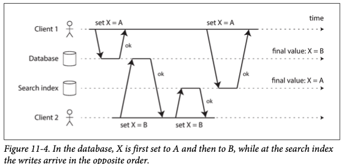
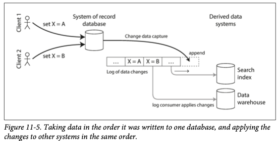

# Stream Processing

- [Transmitting Event Streams](#Transmitting-Event-Streams)
    - [Message Systems](#Message-Systems)
    - [Partitioned Logs](#Partitioned-Logs)
- [Databases and Streams](#Databases-and-Streams)
    - [Keeping Systems in Sync](#Keeping-Systems-in-Sync)
    - [Change Data Capture](#Change-Data-Capture)
    - [Event Sourcing](#Event-Sourcing)
    - [State, Streams, and Immutability](#State,-Streams,-and-Immutability)
- [Processing Streams](#Processing-Streams)
    - [Uses of Stream Processing](#Uses-of-Stream-Processing)
    - [Reasoning About Time](#Reasoning-About-Time)
    - [Stream Joins](#Stream-Joins)

To reduce delay of batch processing, we can run the processing more frequently.  
This is the idea behind _stream processing_.

In this chapter we will look at _event streams_ as a data management mechanism:  
unbounded, incrementally processed counterpart to the batch data.

**Topic**

- how streams are represented, stored, and transmitted over a network
- relationship between stream sand databases
- approaches and tools for processing those streams continually, and way that they can be used to build applications

 

## Transmitting Event Streams

In a stream processing context, a record is more commonly knows as an _event_.  
An event is generated once by a _producer_(also knows as a _publisher_ or _sender_), 
and then potentially processed by multiple _consumers_(_subscribers_ or _recipients_).  
Plus, related events are usually grouped together into a _topic_ or _stream_.  

In principle, a file or database is sufficient to connect producers and consumers:  
a producer writes every event that is generates to the datastore, 
and each consumer periodically polls the datastore to check for events that have appeared since it last ran.  

However, when moving toward continual processing with low delays, polling is expensive.  
So, it is better for consumers to be notified when new events appear.

 

### Message Systems

A common approach for notifying consumers about new events is to use a _messaging system_.  
The basic model of this approach is Unix pipe or TCP communication, which connect exactly one sender with one recipient.  
The messaging system allows multiple producer nodes to send messages to the same topic and allows multiple consumer nodes to receive messages in a topic.  

Within _publish/subscribe_ model, different systems take a wide range of approaches, and there is no one right answer for all purposes:  

1. _What happens if the producers send messages faster than the consumers can process them?_
   - a. drop messages
   - b. buffer messages in a queue - must understand what happened as that queue grows
   - c. apply _backpressure_(blocking the producer from sending more messages)
2. _What happens if nodes crash or temporarily go offline - are any messages lost?_
   - durability may require some combination of writing to disk and/or replication
    
Whether message loss is acceptable depends very much on the application.  
However, beware that if many messages are dropped, it may not be immediately apparent that the metrics are incorrect.  
A nice property of the batch processing systems is that they provide a strong reliability guarantee:  
failed tasks are automatically retried, and partial output from failed tasks is automatically discarded.  

#### Direct Messaging from producers to consumers

- UDP multicast is widely used in the financial industry for streams such as stocks market feeds, where low latency is iomportant.  
- ZeroMQ(brokerless messaging libraries), and nanomsg implements publish/subscribe over TCP or IP multicast.  
- StatsD and Brubeck use UDP messaging for collectin metrics from all machines on the network and monitoring them.  
- If the consumer exposes a service on the network, producers can make a direct HTTP or RPC request.  

With this approach, they generally require the application code to be aware of the possibility of message loss.  
If a consumer is offline, it may miss messages that were sent while it is unreachable.  

#### Message brokers

A widely used alternativ is to send messages via a _message broker_, 
which is essentially a kind of database that is optimized for handling message streams.  

By centralizing the data in the broker, these systems can more easily tolerate clients that come and go, 
and the question of durability is moved to the broker instead.  

A consequence of queueing is also that consumers are generally _asynchronous_:  
when a producer sends a message, it normally only waits for the broker to confirm.  

#### Message brokers compared to databases

1. Deletion
- database: keep data until it is explicitly deleted
- message brokers: delete message when is has been delivered to its consumers -> not suitable for long-term data storage
2. Queue size
- message brokers: assume that their work set is fairly small, so if consumers are slow there and individual message takes longer to process, the overall throughput may degrade
3. Secondary Index
- database: support secondary index
- message brokers: support using a subset of topics matching some pattern
4. Arbitrary queries
- database: based on a point-in-time snapshot of the data, if the data changed, the first client does not find out that its prior result is now outdated
- message brokers: do not support arbitrary queries, but they do notify clients when data changes

#### Multiple consumers

When multiple consumers read messages in the same topic, two main patterns of messaging are used:  

_Load balancing_
- Each message is delivered to _one_ of the consumers
- able to add consumers to parallelize the processing
_ in JMS, it is called a _shared subscription_

_Fan-out_
- Each message is delivered to _all_ of the consumers
- in JMS, it is supported by topic subscriptions, and exchange bindings in AMQP

#### Acknowledgments and redelivery

In order to ensure that the message is not lost by crash, message brokers use _acknowledgments_:  
a client must explicitly tell the broker when it has finished processing a message so that the broker can remove it from the queue.  

If there is no acknowledgment, the broker delivers the message again to another consumer.  
When combined with load balancing, this redelivery behavior has an interesting effect on the ordering of messages.  

Even if the message broker otherwise tries to preserve the order of messages, 
the combination of load balancing with redelivery inevitably leads to message being reordered.  
To avoid this issue, you can use a separate queue per consumer.  

  

### Partitioned Logs

Sending a packet over a network or making a request to a network service is normally a transient operation that leaves no permanent trace.  
You cannot run the same consumer again and expect to get the same result.  

Why can we not have a hybrid, combining the durable storage approach of databases with the low-latency notification facilities of messaing?  
This is the idea behind _log-based message brokers_.  

#### Using logs for message storage

A log is simply an append-only sequence of records on disk.  
The same structure can be used to implement a message broker:  
a producer sends a message by appending it to the end of the log, 
and a consumer receives message by reading the log sequentially.  

In order to scale to higher throughput than a single disk can offer, the log can be _partitioned_.  
Different partitions can then be hosted on different machines, making each partition a separate log that can be read and written independently of other partitions.

With each partition, the broker assigns a monotonically increasing sequence number, or _offset_, to every message.  
There is no ordering guarantee across different partitions.  

Apache Kafka, Amazon Kinesis Streams, and Twitter's DistributedLog are log-based message brokers that work like this.  
Google Cloud Pub/Sub is similar but exposes a JMS-style API rather than a log abstraction.  

#### Logs compared to traditional messaging

The log-based approach trivially supports fan-out messaging, because several consumers can independently read the log without affection each other.  
To achieve load balancing across a group of consumers, the broker can assign entire partitions to nodes in the consumer group.  

**Downside**
- The number of nodes sharing the work of consuming a topic can be at most the number of log partitions in that topic
- If a single message is slow to process, it holds up the processing of subsequent messages in that partition

Thus, in situations where message may be expensive to process and you want to parallelize processing on a message-by-message basis, 
where message ordering is not so important, the JMS/AMQP style of message broker is preferable.  
On the other hand, if each message is fast to process and where message ordering is important, 
the log-based approach works very well.  

#### Consumer offsets

Consuming a partition sequentially makes it easy to tell which messages have been processed:  
offset < current offset have already been processed, offset > current offset have not yet been seen.  
Thus, the broker does not need to track acknowledgments for every single message-
it only needs to periodically recorded the consumer offsets.  
The reduced bookkeeping overhead and the opportunities for batching and pipelining in this approach help increase the throughput of log-based systems.  

This offset is in fact very similar to the _log sequence number_ that is commonly found in single-leader database replication.  
The message broker behaves like a leader database, and the consumer like a follower.  

#### Disk space usage

If you only ever append to the log, you will eventually run out of disk space.  
To reclaim disk space, the log is actually divided into segments, 
and from time to time old segments are deleted or moved to archive storage.  
This means that if a slow consumer cannot keep up with the rate of messages, it will miss some messages.  

Effectively, the log implements a bounded-size buffer, also known as a _circular buffer_ or _ring buffer_.  
Regardless of how long you retain messages, the throughput of a log remains more or less constant, since every message is written to disk anyway.  
Such systems are fast when queues are short and become much slower when they start writing to disk, 
so the throughput depends on the amount of history retained.  

#### When consumers cannot keep up with producers

In this taxonomy, the log-based approach is a form of buffering with a large but fixed-sized buffer.  
If a consumer falls so far behind that the messages it requires are older than what is retained on disk, 
it will not be able to read those messages-so the broker effectively drops old messages.  

Even if a consumer does fall too far behind and starts missing messages; it does not disrupt the service for other consumers.  
You can experimentally consume a production log for development, testing, or debugging purposes, 
without having to worry much about disrupting production services.  

#### Replaying old messages

In a log-based message broker, consuming messages is more like reading from a file:  
it is a read-only operation that does not change the log.  

The only side effect of processing, besides any output of the consumer, is that the consumer offset moves forward.  
However, the offset is under the consumer's control, so it can easily be manipulated if necessary.  

This aspect makes log-based messaging more like the batch processes, 
where derived data is clearly separated from input data through a repeatable transformation process.  
It allows more experimentation and easier recovery from errors and bugs, making it a good tool for integrating dataflows within an organization.  

 

## Databases and Streams

In this section we will first look at a problem that arises in heterogeneous data systems, 
and then explore how we can solve it by bringing ideas from event streams to databases. 

### Keeping Systems in Sync

In practice, most nontrivial applications need to combine several different technologies in order to satisfy their requirements:    
ex. OLTP (cache for speed + full-text index for queries, data warehouse for analytics)  

With data warehouse this synchronization is usually performed by ETL processes.  
In periodic full database dumps are too slow,  
an alternative that is sometimes used in _dual writes_, 
in which the application code explicitly writes to each of the systems when data changes.  

There are some serious problems:   

1. race condition: the data search index and database can be permanently inconsistent with each other, even though no error occured
2. fault-tolerance problem: one of the writes may fail while the other succeeds

If you have only one replicated database with a single leader, 
then that leader determines the order of writes, 
so the state machine replication approach works among replicas of the database.  
However, there isn't a single leader:  
the database may have a leader and the search index may have a leader, 
but neither of follows the other, and so conflicts can occur.  

 

### Change Data Capture

The problem with most databases' logs is that they have been implemented internally, not a public.  
So, it was difficult to take all the changes made in a database and replicate them to a different storage such as a search index, cache, or data warehouse.  

More recently, there has been growing interest in _change data capture_(CDC).  
For example, you can capture the changes in database and apply the changes to a search index.  
If the log of changes is applied in the same order, you can expect the data in the search index to match the data in the database.  
The search index is just consumer of the change stream.  

#### Implementing change data capture

We can call the log consumers _derived data systems_.  
Essentially, change data capture makes one database the leader, and turns the others into followers.  

A log-based message broker is suited for transporting the change events from the source database, since it preserves the ordering of messages.  
Database triggers can be used , but they tend to be fragile and have significant performance overheads.  

Like message brokers, change data capture is usually asynchronous:  
the system of record database does not wait for the change to be applied to consumers before committing it.  
The operation advantage is that adding a slow consumer does not affect the system of record too much, 
but it has downside that all the issues of replication lag apply.  

#### Initial snapshot

Building a new full-text index requires a full copy of the entire database.  
You need to start with a consistent snapshot, as previously discussed with "Setting Up New Followers".  

The snapshot of the database must correspond to a known position of offset in the change log, 
so that you have known at which point to start applying changes after the snapshot has been processed.  

#### Log compaction

If you can only keep a limited amount of log history, 
you need to go through the snapshot process every time you want to add a new derived data system.  
However, _log compaction_ provides a good alternative.  

If the CDC system is set up such that every change has a primary key, 
and every update for a key replaces the previous value for that key, 
then it's sufficient to keep just the most recent write for a particular key.  

Now, whenever you want to rebuild a derived data system such as a search index, 
you can start a new consumer from offset 0 fof the log-compacted topic, 
and sequentially scan over all messages in the log.  

#### API support for change streams

Increasingly, databases are beginning to support change streams as a first-class interface, 
rather than the typical retrofitted and reverse-engineered CDC efforts.  

- RethinkDB: allows queries to subscribe to notifications when the results of a query change
- Firebase, CouchDB: provide data synchronization which is made available to applications
- Meteor: use MongoDB oplog to subscribe to data changes
- VoltDB: export data from a database in the form of a stream
- Kafka Connect: update derived data systems such as search indexes, and also feed into stream processing systems

  

### Event Sourcing

Similarly to change data capture, 
event sourcing involves storing all changes to the application state as a log of change events.  
The biggest difference is that event sourcing applies the idea at a different level of abstraction:  

- data capture
    - uses database in a mutable way
    - logs extracted from the database at a low level, which ensures the order of writes, avoiding race conditions
    - application does not need to be aware that CDC is occurring
- event sourcing
    - basis of immutable events
    - append-only, updates or deletes are discouraged or prohibited
    
Event sourcing is a powerful technique for a data modeling.  
This approach allows that new side effect to easily be chained off the existing event.  

#### Deriving current state from the event log

Applications that use event sourcing need to take the log of events and transform it into application state that is suitable.  
This transformation can use arbitrary logic, but it should be deterministic so that you can run it again and derive the same application state from the event log.  

**Event sourcing compare to CDC**
- at a higher level
- later events typically do not override prior events, so you need the full history of events to reconstruct the final state
- Log compaction is ot possible in the same way

#### Commands and events

_command_: a request from a user first arrives
_event_: if the validation is successful, and the command is accepted > durable and immutable
_fact_: at the point when the event is generated

A consumer of the event stream is not allowed to reject an event.  

### State, Streams, and Immutability

Batch processing benefits from teh immutability of its input files.  
This principle of immutability is also what makes event sourcing and change data capture so powerful.  

The key idea is that mutable state and an append-only log of immutable events do not contradict each other.  
The log of all changes, the _change-log_, represents the evolution of state over time.  

If you store the changelog durably, that simply has the effect of making the state reproducible.

#### Advantages of immutable events

1. If incorrect figures, derived from the incorrect ledger, have already been published, then the figures for the next accounting period include a correction.  
2. With an append-only log of immutable events, it is much easier to diagnose what happened and recover from the problem.  
3. Immutable events also capture more information than just the current state.  

#### Deriving several views from the same event log

Moreover, by separating mutable state from the immutable event log, 
you can derive several different read-oriented representations from the same log of event just like having multiple consumers of a stream.  

Having an explicit translation step from ean event log to a database makes it easier to evolve your application over time.  
You can use the event log to build a separate read-optimized view for the new feature, 
and run it alongside the existing systems without having to modify them.  
Running old and new systems side by side is often easier than performing a complicated schema migration in an existing system.  

Many of the complexities of schema design, indexing, and storage engines are the result of wanting to support certain query and access patterns.  
For this reason, you gain a lot of flexibility by separating the form in which data is written from the form it is read, 
and by allowing several different read views. This idea is sometimes known as _command query responsibility segregation_.  

Plus, it is entirely reasonable to denormalize data in the read-optimized views, 
as the translation process gives you a mechanism for keeping it consistent with the event log.  
The twitter example is an example of read-optimized state:  
home timelines are highly denormalized.  

#### Concurrency control

The biggest downside of event sourcing and change data capture is that the consumers of the event log are usually asynchronous, 
therefore, user can find that their write has not yet been reflected in the read view.  

One solution would be to perform the updates of the read view synchronously with appending the event to the log.  
On the other hand, deriving the current state from an event log also simplifies some aspects of concurrency control.  

If the event log and the application state are partitioned in the same way, 
then a straightforward single-threaded log consumer needs no concurrency control for writes.  

#### Limitations of immutability

Many systems that don't use an event-sourced model nevertheless rely on immutability.  
(Also version control systems such as Git, Mercurial, Fossil)

To what extent is it feasible to keep an immutable history of all changes forever?  
The answer depends on the amount of churn in the dataset.  
Some workloads rarely update or delete are easy to make immutable.  
If workloads have a high rate of updates and deletes, immutable history may grow prohibitively large, 
fragmentation may become an issue, and the performance of compaction and garbage collection becomes crucial for operational robustness.  

Beside the performance reason, 
there may also be circumstances in which you need data to be deleted for administrative reasons, in spite of all immutability(privacy regulations, data protection legislation, etc).  
In these circumstances, you actually want to rewrite history and pretend that the data was never written in the first place.  
(Datomic - _excision_, Fossil - _shunning_)

Truly deleting data is surprisingly hard, since copies can live in many places.  
Deletion is more a matter of "making it harder to retrieve the data" than "making it impossible to retrieve the data".  

  

## Processing Streams

What you can do with the stream once you have it, you can process it with three options:  

1. You can take the data in the events and write it to a database, cache, search index, or similar storage, 
   from where it can then be queried by other clients.  
2. You can push events to users in some way(emailing, push notification, etc), and human is the ultimate consumer of the stream.  
3. You can process one or more input streams to produce one or more output streams.  

In option 3, a piece of code that processes streams like this is known as an _operator_ or a _job_.  
It is closely related to the Unix processes and MapReduce jobs.  

The one crucial difference to batch jobs is that a stream never ends.  
Therefore, sorting does not make sense with an unbounded dataset, and so sort-merge joins cannot be used.  
Fault-tolerance mechanisms must also change:  
with a batch job, a failed task can simply be restarted from the beginning, 
but with a stream job that has been running for several years, restarting from the beginning after a crash may not be a viable option.  

### Uses of Stream Processing

Stream Processing has long been used for monitoring purposes(usage patterns, trading systems, manufacturing systems, etc).  
These kinds of applications require quite sophisticated pattern matching and correlations.  

#### Complex event processing

_Complex event processing_(CEP) is similarly to the way that a regular expression allows you to search for certain patterns of characters.  
CEP allows you to specify rules to search for certain patterns of events in a stream.  

CEP systems often use a high-level declarative query language like SQL, or a graphical user interface, 
to describe the patterns of events that should be detected.  
When a match is found, the engine emits a _complex event_ with the details of the event pattern that was detected.  

CEP engines queries are stored long-term, 
and events from the input streams continuously flow past them in search of a query that matches an event pattern.  
Implementations include Esper, IBM InfoSphere Streams, Apama, TIBCO StreamBase, SQLstream, Samza).  

#### Stream analytics

Another area in which stream processing is used if for _analytics_ on streams.  
Analytics tends to be less interested in finding specific event sequences 
and is more oriented toward aggregations ad statistical metrics over a large number of events.  
Such statistics are usually computed over fixed time intervals, which is known as a _window_.  

Stream analytics systems sometimes use probabilistic algorithms.  
Probabilistic algorithms produce approximate results, but have the advantage of requiring significantly less memory in stream processor than exact algorithms.   
This can leads people to believe that stream processing systems are always lossy and inexact but that is wrong:  
there is nothing inherently approximate about stream processing, and probabilistic algorithms are merely an optimization.  

#### Maintaining materialized views

We saw that a stream of changes to a database can be used to keep derived data systems, such as caches, search indexes, 
and data warehouses, up to date with a source database(_materialized views_).  

Building the materialized view potentially requires _all_ events over an arbitrary time period.  
In effect, you need a window that stretches all the way back to the beginning of time.  

In principle, any stream processor could be used for materialized view maintenance, 
although the need to maintain events forever runs counter to the assumptions of some analytics-oriented frameworks 
that mostly operate on windows of a limited duration.  

#### Search on streams

There is also sometimes a need to search for individual events based on complex criteria, such as full-text search queries.  
Conventional search engines first index the documents and then run queries over the index.  
By contrast, searching a stream turns the processing on its head:  
the queries are stored, and the documents run past the queries.  

This can get slow if you have a large number of queries.  
To optimized the process, it is possible to index the queries as well as the documents, 
and thus narrow down the set of queries that may match.  

#### Message passing and RPC

### Reasoning About Time

#### Event time versus processing time

#### Knowing when you're ready

#### Whose clock are you using, anyway?

#### Types of windows

### Stream Joins

#### Stream-stream join (window join)

#### Stream-table join (stream enrichment)

#### Table-table join (materialized view mainenance)

#### Time-dependence of joins

### Fault Tolerance

#### Microbatching and checkpointing

#### Atomic commit revisited

#### Idempotence

#### Rebuilding state after a failure

